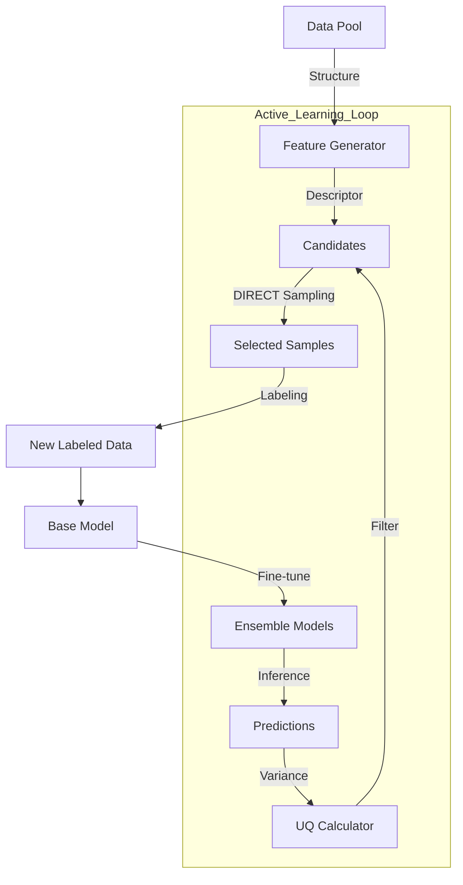

# DP-EVA 项目开发文档

**版本**: 2.0.0
**生成日期**: 2026-01-27
**作者**: Quantum Misaka with Trae SOLO

---

## 1. 项目概述 (Overview)

### 1.1 项目简介
DP-EVA (Deep Potential EVolution Accelerator) 是一个面向 DPA3 (Deep Potential v3) 高效微调的自动化主动学习框架。该项目旨在通过智能化的数据筛选策略，从海量无标签数据中识别出最具价值的样本（高模型不确定度 + 高结构代表性），从而以最小的数据标注成本实现模型性能的最大化提升。

### 1.2 核心哲学 (The Zen of DP-EVA)
本项目遵循 Python 工程化最佳实践进行重构，强调：
*   **显式配置**：拒绝环境变量魔法，使用清晰的 Config 字典/文件驱动。
*   **模块解耦**：将复杂的科研脚本拆解为职责单一的原子模块 (Training, Inference, Uncertainty, Sampling)。
*   **双模调度**：底层统一封装 JobManager，无缝支持 Local (Multiprocessing) 和 Slurm 集群环境。

---

## 2. 系统架构 (Architecture)

### 2.1 目录结构
项目代码组织在 `src/dpeva` 包下，结构清晰：

```text
dpeva/
├── runner/                 # 执行入口脚本 (CLI/Scripts)
├── src/dpeva/
│   ├── workflows/          # [核心] 业务流程编排层
│   │   ├── train.py        # 训练工作流
│   │   ├── infer.py        # 推理与分析工作流
│   │   └── collect.py      # 数据采集工作流
│   ├── training/           # 训练模块 (ParallelTrainer)
│   ├── inference/          # 推理模块 (ModelEvaluator, StatsCalculator)
│   ├── uncertain/          # 不确定度模块 (Calculator, Filter, Visualization)
│   ├── sampling/           # 采样模块 (DIRECT, PCA, Clustering)
│   ├── feature/            # 特征生成模块 (DescriptorGenerator)
│   ├── submission/         # 任务提交抽象层 (JobManager, Slurm Templates)
│   ├── io/                 # 数据读写辅助 (DPTestResults, DataProc)
│   ├── utils/              # 通用工具
└── test/                   # [开发专用] 开发验证与临时测试脚本，不随包发布
```

### 2.2 数据流图 (Data Flow)


---

## 3. 核心模块详解 (Modules)

### 3.1 Training 模块 (`dpeva.training`)
负责管理 DeepMD 模型的并行训练任务。
*   **`ParallelTrainer`**: 核心类。支持 `init` (初始化) 和 `cont` (断点续训) 模式。
*   **特性**:
    *   自动目录隔离 (`0/`, `1/`, `2/`, `3/`)。
    *   支持 `OMP_NUM_THREADS` 自动配置。
    *   内置随机种子循环机制，确保多模型多样性。

### 3.2 Inference 模块 (`dpeva.inference`)
负责模型批量推理及后续的误差分析。
*   **`InferenceWorkflow`**: 
    *   自动扫描模型目录并提交 `dp test` 任务。
    *   **高级分析**: 内置 `StatsCalculator`，自动计算 RMSE/MAE。
    *   **相对能量分析**: 支持通过最小二乘法 (Least Squares) 拟合原子能量，计算 Cohesive Energy，从而在不同组分体系间进行公平比较。
    *   **可视化**: 自动生成 Parity Plot (能量/力) 和误差分布图。

### 3.3 Uncertainty & Sampling 模块 (`dpeva.uncertain`, `dpeva.sampling`)
这是主动学习的大脑，负责从海量数据中“淘金”。
*   **UQ 策略**: 
    *   **QbC (Query by Committee)**: 计算多模型预测方差。
    *   **RND (Random Network Distillation)**: 计算当前模型与参考模型的偏差。
    *   **对齐机制**: 使用 `RobustScaler` (Median/IQR) 将 RND 信号对齐到 QbC 尺度，增强鲁棒性。
*   **筛选策略**: 支持 `strict`, `tangent`, `circle` 等多种 2D 边界筛选算法。
*   **DIRECT 采样**: 
    *   基于 DPA3 描述符进行 PCA 降维。
    *   使用 BIRCH 聚类 + 覆盖度最大化采样，确保样本在化学空间的多样性。

---

## 4. 工作流与使用指南 (Workflows)

### 4.1 训练工作流 (Train)
用于启动多模型并行微调。

**配置示例 (`config_train.json`)**:
```json
{
    "work_dir": "./training_task",
    "num_models": 4,
    "mode": "init",
    "base_model_path": "/path/to/pretrained.pt",
    "input_json_path": "input.json",
    "training_data_path": "/path/to/data",
    "backend": "local",
    "omp_threads": 8
}
```
**运行方式**:
```python
from dpeva.workflows.train import TrainingWorkflow
TrainingWorkflow(config).run()
```

### 4.2 推理与分析工作流 (Infer)
用于批量测试模型性能并生成报表。

**配置示例 (`config_infer.json`)**:
```json
{
    "output_basedir": "./training_task",
    "test_data_path": "/path/to/test_data",
    "backend": "slurm",
    "submission": {
        "slurm_config": {
            "partition": "gpu",
            "gpus_per_node": 1
        }
    }
}
```
**运行方式**:
```python
from dpeva.workflows.infer import InferenceWorkflow
InferenceWorkflow(config).run()
```

### 4.3 数据采集工作流 (Collect)
执行“不确定度计算 -> 筛选 -> 采样 -> 导出”全流程。

**配置示例 (`config_collect.json`)**:
```json
{
    "project": "./training_task",
    "desc_dir": "./descriptors",
    "testdata_dir": "./unlabeled_data",
    "uq_select_scheme": "tangent_lo",
    "num_selection": 100,
    "root_savedir": "iteration_1_selected"
}
```
**运行方式**:
详见 `runner/run_uq_collect.py`。

---

## 5. 项目现状与重构评估 (Status & Review)

### 5.1 代码质量评估
*   **架构清晰度**: ⭐⭐⭐⭐⭐ (5/5) - 职责分离明确，不再有几千行的 God Script。
*   **鲁棒性**: ⭐⭐⭐⭐ (4/5) - 关键路径（如数据加载、空值检查）已有防护，但在极端的 `dpdata` 格式兼容性上仍有提升空间。
*   **扩展性**: ⭐⭐⭐⭐⭐ (5/5) - 新增 UQ 策略或采样算法只需继承基类即可。

### 5.2 重构完成度
相比于 `utils/uq/uq-post-view.py` 时代的旧代码，重构目标达成率如下：

| 目标 | 状态 | 说明 |
| :--- | :--- | :--- |
| **模块化拆分** | ✅ 完成 | 所有核心逻辑均已迁移至 `src/dpeva`。 |
| **配置与逻辑分离** | ✅ 完成 | 彻底消除了硬编码路径。 |
| **Inference 后处理** | ✅ 完成 | 实现了 `StatsCalculator` 和自动可视化，填补了之前的 Gap。 |
| **本地/Slurm 双模** | ✅ 完成 | `JobManager` 表现稳定。 |
| **集成测试** | 🔄 进行中 | 核心模块已验证，但全流程端到端自动化测试脚本尚待完善。 |

### 5.3 已知问题与待办
1.  **CLI 工具**: 目前仍依赖 `runner/` 下的 Python 脚本作为入口，建议封装统一的 `dpeva` 命令行工具 (e.g., `dpeva train -c config.json`)。
2.  **dpdata 依赖**: Cohesive Energy 计算强依赖于 `dpdata` 对混合格式的解析能力，需注意数据格式规范。
3.  **deepmd-kit 多后端支持**: 项目目前只支持 deepmd-kit 的 PyTorch 后端，不支持 TensorFlow 和 JAX。
4.  **Slurm Backend 优化**：项目目前只支持提交 Slurm 任务，不支持监控任务状态并自动处理后续任务或异常。

---

## 6. 开发与部署 (DevOps)

### 6.1 环境要求
*   Python >= 3.8
*   DeepMD-kit (及 `dpdata`)
*   NumPy, Pandas, Scikit-learn, Matplotlib, Seaborn

### 6.2 安装方式
```bash
cd dpeva
pip install -e .
```

### 6.3 验证测试 (开发环境)
`test/` 目录下的内容仅用于开发阶段的临时验证，不作为项目发布的一部分。开发者在修改核心逻辑后，可使用该目录下的脚本进行快速回归测试。

运行验证脚本以确保环境正常：
```bash
# 注意：test 文件夹内容仅用于开发测试，不会打包发布
cd test/verification_test_run
python run_refactored_workflow.py
```
若运行成功且无报错，并在 `dpeva_uq_post_refactored` 目录下生成了图表和数据，则说明开发环境下的核心功能正常。对于生产环境验证，请参考 `runner/` 下的示例脚本。
