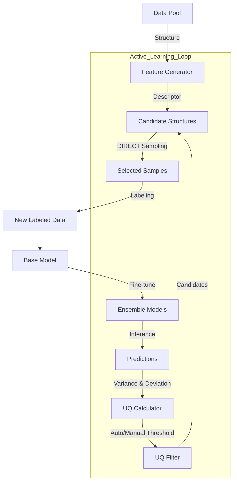

# DP-EVA 项目开发文档

* **版本**: 2.1.0
* **生成日期**: 2026-01-28
* **作者**: Quantum Misaka with Trae SOLO

---

## 1. 项目概述 (Overview)

### 1.1 项目简介
DP-EVA (Deep Potential EVolution Accelerator) 是一个面向 DPA3 (Deep Potential v3) 高效微调的自动化主动学习框架。该项目旨在通过智能化的数据筛选策略，从海量无标签数据中识别出最具价值的样本（高模型不确定度 + 高结构代表性），从而以最小的数据标注成本实现模型性能的最大化提升。

### 1.2 核心哲学 (The Zen of DP-EVA)
本项目遵循 Python 工程化最佳实践进行重构，强调：
*   **显式配置 (Explicit Configuration)**：拒绝环境变量魔法，使用清晰的 Config 字典/文件驱动。
*   **模块解耦 (Modular Design)**：将复杂的科研脚本拆解为职责单一的原子模块 (Training, Inference, Uncertainty, Sampling)。
*   **双模调度 (Dual-Mode Scheduling)**：底层统一封装 `JobManager`，无缝支持 Local (Multiprocessing) 和 Slurm 集群环境。
*   **日志规范 (Logging Discipline)**：库代码不干预全局日志配置，确保日志输出清晰、无冗余且易于追踪。

---

## 2. 系统架构 (Architecture)

### 2.1 目录结构
项目代码组织在 `src/dpeva` 包下，结构清晰：

```text
dpeva/
├── runner/                 # [用户接口] 执行入口脚本 (CLI/Scripts)
│   ├── dpeva_train/        # 训练任务入口
│   ├── dpeva_test/         # 推理任务入口
│   ├── dpeva_collect/      # 采集任务入口
│   └── ...
├── src/dpeva/
│   ├── workflows/          # [核心] 业务流程编排层
│   │   ├── train.py        # 训练工作流 (TrainingWorkflow)
│   │   ├── infer.py        # 推理与分析工作流 (InferenceWorkflow)
│   │   ├── collect.py      # 数据采集工作流 (CollectionWorkflow)
│   │   └── feature.py      # 特征生成工作流 (FeatureWorkflow)
│   ├── training/           # 训练模块 (ParallelTrainer)
│   ├── inference/          # 推理模块 (StatsCalculator, Visualizer)
│   ├── uncertain/          # 不确定度模块 (UQCalculator, UQFilter, Visualizer)
│   ├── sampling/           # 采样模块 (DIRECT, PCA, Clustering)
│   ├── feature/            # 特征生成模块 (DescriptorGenerator)
│   ├── submission/         # 任务提交抽象层 (JobManager, JobConfig, Templates)
│   ├── io/                 # 数据读写辅助 (DPTestResults, DataProc)
│   └── utils/              # 通用工具
└── test/                   # [开发专用] 单元测试与回归测试脚本
```

### 2.2 数据流图 (Data Flow)


---

## 3. 核心模块详解 (Modules)

### 3.1 Training 模块 (`dpeva.training`)
负责管理 DeepMD 模型的并行训练任务。
*   **`ParallelTrainer`**: 核心类。支持 `init` (初始化) 和 `cont` (断点续训) 模式。
*   **特性**:
    *   自动工作目录隔离 (`0/`, `1/`, `2/`, `3/`)。
    *   支持 `OMP_NUM_THREADS` 自动配置。
    *   内置随机种子循环机制，确保多模型多样性。

### 3.2 Inference 模块 (`dpeva.inference`)
负责模型批量推理及后续的误差分析。
*   **`InferenceWorkflow`**: 
    *   自动扫描模型目录并提交 `dp test` 任务。
    *   **高级分析**: 内置 `StatsCalculator`，自动计算 RMSE/MAE。
    *   **相对能量分析**: 支持通过最小二乘法 (Least Squares) 拟合原子能量，计算 Cohesive Energy，从而在不同组分体系间进行公平比较。
    *   **可视化**: 自动生成 Parity Plot (能量/力) 和误差分布图。

### 3.3 Uncertainty & Sampling 模块 (`dpeva.uncertain`, `dpeva.sampling`)
这是主动学习的大脑，负责从海量数据中“淘金”。
*   **UQ 计算 (`UQCalculator`)**: 
    *   **QbC (Query by Committee)**: 计算多模型预测方差。
    *   **RND (Random Network Distillation)**: 计算当前模型与参考模型的偏差。
    *   **自动阈值 (Auto-Threshold)**: 基于 KDE (核密度估计) 自动识别不确定度分布峰值，自适应确定 `trust_lo`。
*   **筛选策略 (`UQFilter`)**: 支持 `strict`, `tangent`, `circle` 等多种 2D 边界筛选算法。
*   **DIRECT 采样 (`DIRECTSampler`)**: 
    *   基于 DPA3 描述符进行 PCA 降维。
    *   使用 BIRCH 聚类 + 覆盖度最大化采样，确保样本在化学空间的多样性。

### 3.4 Feature 模块 (`dpeva.feature`)
负责生成原子结构的描述符。
*   **`DescriptorGenerator`**:
    *   **CLI 模式**: 调用 `dp eval-desc` 命令，支持 Slurm 提交。
    *   **Python 模式**: 直接调用 `deepmd.infer` API，适合小规模或调试使用。
    *   **日志优化**: 智能处理日志输出，避免在 Slurm 环境下产生冗余日志文件。

### 3.5 Submission 模块 (`dpeva.submission`)
统一的任务提交抽象层。
*   **`JobManager`**: 屏蔽 Local/Slurm 差异。
*   **`JobConfig`**: 强类型的作业配置类，支持 Partition, QoS, GPUs 等 Slurm 高级参数。
*   **`TemplateEngine`**: 基于模板生成作业脚本，易于扩展和定制。

---

## 4. 接口使用指南 (Runner Interface)

所有用户入口脚本均位于 `runner/` 目录下，按功能分类。

### 4.1 训练 (Train)
**路径**: `runner/dpeva_train/run_train.py`
**配置**: `config.json`

```json
{
    "work_dir": "./training_task",
    "num_models": 4,
    "mode": "init",  // 或 "cont"
    "base_model_path": "/path/to/pretrained.pt",
    "input_json_path": "input.json",
    "training_data_path": "/path/to/data",
    "backend": "local",
    "omp_threads": 8
}
```

### 4.2 推理与分析 (Test)
**路径**: `runner/dpeva_test/run_inference.py`
**配置**: `config.json`

```json
{
    "output_basedir": "./training_task",
    "test_data_path": "/path/to/test_data",
    "backend": "slurm",
    "submission": {
        "slurm_config": {
            "partition": "gpu",
            "gpus_per_node": 1
        }
    }
}
```

### 4.3 描述符生成 (EvalDesc)
**路径**: `runner/dpeva_evaldesc/run_evaldesc.py`
**配置**: `config.json`

```json
{
    "datadir": "./data_pool",
    "modelpath": "/path/to/model.pt",
    "savedir": "./descriptors",
    "mode": "cli",
    "submission": {
        "backend": "slurm",
        "slurm_config": { "partition": "cpu" }
    }
}
```

### 4.4 数据采集 (Collect)
**路径**: `runner/dpeva_collect/run_uq_collect.py`
**配置**: `config.json`

**新增 Auto-UQ 配置示例**:
```json
{
    "project": "./training_task",
    "desc_dir": "./descriptors",
    "testdata_dir": "./unlabeled_data",
    "uq_select_scheme": "tangent_lo",
    "num_selection": 100,
    "root_savedir": "iteration_1_selected",
    
    "uq_trust_mode": "auto",      // 启用自动阈值
    "uq_trust_ratio": 0.33,       // 峰值下降比率
    "uq_trust_width": 0.25        // 信任区间宽度
}
```

---

## 5. 开发与测试 (Development)

### 5.1 代码规范
*   **日志**: 禁止在 `src/dpeva` 库文件中调用 `logging.basicConfig()`。仅在 `runner` 脚本中配置全局日志。
*   **路径**: 所有文件操作应使用绝对路径 (`os.path.abspath`)。
*   **异常**: 显式捕获并记录异常，避免静默失败。

### 5.2 验证测试
`test/` 目录包含开发阶段的验证脚本。

*   **运行 Auto-UQ 测试**:
    ```bash
    cd test/verification_test_run
    python run_auto_uq_test.py
    ```
    此脚本会验证 KDE 阈值计算逻辑及可视化图表的生成（含截断图和 Parity Plot）。

### 5.3 常见问题 (FAQ)

**Q: 为什么生成的日志文件有 `eval_desc.log` 和 `eval_desc.out`？**
A: 在旧版本中存在此冗余。新版 `DescriptorGenerator` 已修复此问题：Slurm 模式下仅生成 `eval_desc.log` (由 Slurm 输出重定向)，Local 模式下使用 `tee` 生成同名日志。

**Q: 如何在没有真值 (Ground Truth) 的情况下运行采集流程？**
A: `CollectionWorkflow` 已增强鲁棒性。当检测到无真值时，会自动跳过误差相关的 Parity Plot 绘制，但保留 UQ 分布图和采样逻辑，确保流程不中断。

**Q: Auto-UQ 计算失败怎么办？**
A: 如果数据分布极其异常导致 KDE 失败，系统会自动回退到 `config.json` 中配置的 `uq_qbc_trust_lo` 等手动参数，并输出警告日志。

---

## 6. 附录：审阅报告摘要 (Review Summary)

*   **代码质量**: 核心模块职责分离清晰，符合 "Explicit is better than implicit" 原则。
*   **日志系统**: 已完成全面清洗，消除了库代码对全局 Logging 的侵入，解决了文件冗余问题。
*   **功能完备性**: 
    *   Auto-UQ 算法已实装并经过测试。
    *   可视化模块实现了与 Legacy 脚本的完全功能对齐（包括截断视图）。
*   **接口一致性**: `runner` 层正确封装了底层 `Workflow`，配置项命名统一。

**建议**: 后续版本可考虑将 `runner/` 下的脚本封装为统一的 `dpeva` 命令行工具 (CLI Tool)，进一步简化用户体验。
