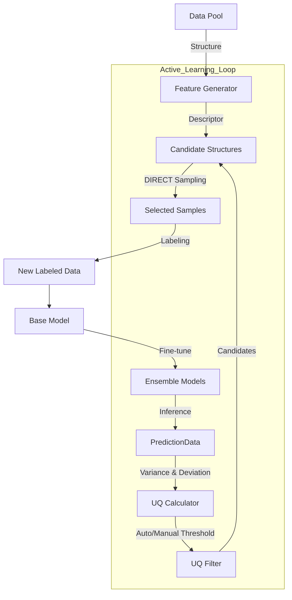

# DP-EVA 项目开发文档

* **版本**: 2.3.0
* **生成日期**: 2026-01-31
* **作者**: Quantum Misaka with Trae SOLO

---

## 1. 项目概述 (Overview)

### 1.1 项目简介
DP-EVA (Deep Potential EVolution Accelerator) 是一个面向 DPA3 (Deep Potential v3) 高效微调的自动化主动学习框架。该项目旨在通过智能化的数据筛选策略，从海量无标签数据中识别出最具价值的样本（高模型不确定度 + 高结构代表性），从而以最小的数据标注成本实现模型性能的最大化提升。

### 1.2 核心哲学 (The Zen of DP-EVA)
本项目遵循 Python 工程化最佳实践进行重构，强调：
*   **显式配置 (Explicit Configuration)**：拒绝环境变量魔法，使用清晰的 Config 字典/文件驱动。
*   **模块解耦 (Modular Design)**：将复杂的科研脚本拆解为职责单一的原子模块 (Training, Inference, Uncertainty, Sampling)。
*   **数据标准化 (Data Standardization)**：引入标准化的 `PredictionData` 接口，替代不透明的遗留对象。
*   **双模调度 (Dual-Mode Scheduling)**：底层统一封装 `JobManager`，无缝支持 Local (Multiprocessing) 和 Slurm 集群环境。
*   **日志规范 (Logging Discipline)**：库代码不干预全局日志配置，确保日志输出清晰、无冗余且易于追踪。

---

## 2. 系统架构 (Architecture)

### 2.1 目录结构
项目代码组织在 `src/dpeva` 包下，结构清晰：

```text
dpeva/
├── runner/                 # [用户接口] 执行入口脚本 (CLI/Scripts)
│   ├── dpeva_train/        # 训练任务入口
│   ├── dpeva_test/         # 推理任务入口
│   ├── dpeva_collect/      # 采集任务入口
│   └── ...
├── src/dpeva/
│   ├── workflows/          # [核心] 业务流程编排层
│   │   ├── train.py        # 训练工作流 (TrainingWorkflow)
│   │   ├── infer.py        # 推理与分析工作流 (InferenceWorkflow)
│   │   ├── collect.py      # 数据采集工作流 (CollectionWorkflow)
│   │   └── feature.py      # 特征生成工作流 (FeatureWorkflow)
│   ├── training/           # 训练模块 (ParallelTrainer)
│   ├── inference/          # 推理模块 (StatsCalculator, Visualizer)
│   ├── uncertain/          # 不确定度模块 (UQCalculator, UQFilter, Visualizer)
│   ├── sampling/           # 采样模块 (DIRECT, PCA, Clustering)
│   ├── feature/            # 特征生成模块 (DescriptorGenerator)
│   ├── submission/         # 任务提交抽象层 (JobManager, JobConfig, Templates)
│   ├── io/                 # 数据读写辅助 (DPTestResultParser, PredictionData, types)
│   └── utils/              # 通用工具
└── test/                   # [开发专用] 单元测试与回归测试脚本
```

### 2.2 数据流图 (Data Flow)


---

## 3. 核心模块详解 (Modules)

### 3.1 Training 模块 (`dpeva.training`)
负责管理 DeepMD 模型的并行训练任务。
*   **`ParallelTrainer`**: 核心类。支持 `init` (初始化) 和 `cont` (断点续训) 模式。
*   **特性**:
    *   自动工作目录隔离 (`0/`, `1/`, `2/`, `3/`)。
    *   支持 `OMP_NUM_THREADS` 自动配置。
    *   内置随机种子循环机制，确保多模型多样性。

### 3.2 Inference 模块 (`dpeva.inference`)
负责模型批量推理及后续的误差分析。
*   **`InferenceWorkflow`**: 
    *   自动扫描模型目录并提交 `dp test` 任务。
    *   **高级分析**: 内置 `StatsCalculator`，自动计算 RMSE/MAE。
    *   **相对能量分析**: 支持通过最小二乘法 (Least Squares) 拟合原子能量，计算 Cohesive Energy，从而在不同组分体系间进行公平比较。
    *   **可视化**: 自动生成 Parity Plot (能量/力) 和误差分布图。

### 3.3 Uncertainty & Sampling 模块 (`dpeva.uncertain`, `dpeva.sampling`)
这是主动学习的大脑，负责从海量数据中“淘金”。
*   **数据标准化 (`io.types.PredictionData`)**: 
    *   取代了旧版的 `DPTestResults` 遗留类。
    *   统一使用 `PredictionData` (Dataclass) 作为数据容器，包含 `energy`, `force`, `virial` 等标准字段。
*   **UQ 计算 (`UQCalculator`)**: 
    *   **QbC (Query by Committee)**: 计算多模型预测方差。公式：$\sigma_{QbC} = \sqrt{\sum_{i=x,y,z} Var(F_i)}$。
    *   **RND (Random Network Distillation)**: 计算当前模型与参考模型的偏差。公式：$\sigma_{RND} = \sqrt{\sum_{i=x,y,z} Mean((F_i^{pred} - F_i^{base})^2)}$。
    *   **数值稳定性 (Robustness)**: 实现了 **"Clamp-and-Clean"** 策略：
        *   **Clamp**: 强制方差计算结果非负 (`np.maximum(var, 0.0)`)，消除浮点误差导致的 RuntimeWarning。
        *   **Clean**: 自动检测 `NaN` 输出并将其替换为 `Infinity`（最大不确定度），确保异常模型预测会被标记为 `Failed` 而非被忽略。
        *   **Robust Scaling**: 手动实现了抗 Inf 的 Robust Scaling 算法，仅基于有限值计算统计量，保留 `Inf` 的极端属性。
    *   **自动阈值 (Auto-Threshold)**: 基于 KDE (核密度估计) 自动识别不确定度分布峰值，自适应确定 `trust_lo`。
*   **筛选策略 (`UQFilter`)**: 支持 `strict`, `tangent`, `circle` 等多种 2D 边界筛选算法。
*   **DIRECT 采样 (`DIRECTSampler`)**: 
    *   **联合采样 (Joint Sampling)**: 支持同时加载训练集和候选集，在联合特征空间中进行覆盖度最大化采样，避免新样本与旧样本重复。
    *   **基于聚类**: 使用 BIRCH 聚类算法在 PCA 降维后的空间中寻找最具代表性的样本点。

### 3.4 Feature 模块 (`dpeva.feature`)
负责生成原子结构的描述符。
*   **`DescriptorGenerator`**:
    *   **CLI 模式**: 调用 `dp eval-desc` 命令，支持 Slurm 提交。
    *   **Python 模式**: 直接调用 `deepmd.infer` API，适合小规模或调试使用。
    *   **单数据池兼容**: 智能识别 `desc_dir/System.npy` 格式的描述符文件，兼容单数据池模式下的平铺结构。
    *   **多数据池支持**: 递归支持 `Dataset/System` 3层结构，通过增强的路径解析逻辑确保描述符与数据一一对应。

### 3.5 Submission 模块 (`dpeva.submission`)
统一的任务提交抽象层。
*   **`JobManager`**: 屏蔽 Local/Slurm 差异。
*   **`JobConfig`**: 强类型的作业配置类，支持 Partition, QoS, GPUs 等 Slurm 高级参数。
*   **`TemplateEngine`**: 基于模板生成作业脚本，易于扩展和定制。

---

## 4. 接口使用指南 (Runner Interface)

所有用户入口脚本均位于 `runner/` 目录下，按功能分类。

### 4.1 训练 (Train)
**路径**: `runner/dpeva_train/run_train.py`
**配置**: `config.json`

```json
{
    "work_dir": "./training_task",
    "num_models": 4,
    "mode": "init",  // 或 "cont"
    "base_model_path": "/path/to/pretrained.pt",
    "input_json_path": "input.json",
    "training_data_path": "/path/to/data",
    "backend": "local",
    "omp_threads": 8
}
```

### 4.2 推理与分析 (Test)
**路径**: `runner/dpeva_test/run_inference.py`
**配置**: `config.json`

```json
{
    "output_basedir": "./training_task",
    "data_path": "/path/to/test_data", // [v2.3.0 更新] 统一命名为 data_path
    "backend": "slurm",
    "submission": {
        "slurm_config": {
            "partition": "gpu",
            "gpus_per_node": 1
        }
    }
}
```

### 4.3 描述符生成 (EvalDesc)
**路径**: `runner/dpeva_evaldesc/run_evaldesc.py`
**配置**: `config.json`

```json
{
    "data_path": "./data_pool", // [v2.3.0 更新] 统一命名为 data_path
    "modelpath": "/path/to/model.pt",
    "savedir": "./descriptors",
    "mode": "cli",
    "submission": {
        "backend": "slurm",
        "slurm_config": { "partition": "cpu" }
    }
}
```

### 4.4 数据采集 (Collect)
**路径**: `runner/dpeva_collect/run_uq_collect.py`
**配置**: `config.json`

**联合采样与 Auto-UQ 配置示例**:
```json
{
    "project": "./training_task",
    "desc_dir": "./descriptors",
    "testdata_dir": "./unlabeled_data",
    
    // 联合采样配置 (Joint Sampling)
    "training_desc_dir": "./training_descriptors", // [可选] 训练集描述符路径
    "training_data_dir": "./training_data",        // [可选] 训练集结构路径
    
    "uq_select_scheme": "tangent_lo",
    "num_selection": 1000,        // [注意] 联合模式下表示覆盖集总数 (Target Cluster Count)
    
    "root_savedir": "iteration_1_selected",
    
    // UQ 参数配置 (支持全局或独立配置)
    "uq_trust_mode": "auto",      
    "uq_trust_ratio": 0.50,       // 全局比例
    "uq_trust_width": 0.15,       // 全局宽度
    // "uq_qbc_trust_ratio": 0.40 // [可选] 覆盖全局配置
}
```

#### 4.4.1 `uq_trust_mode` 配置说明

该参数决定了不确定度信任阈值 (`uq_trust_lo`) 的确定方式：

| 模式 | 配置值 (`uq_trust_mode`) | 说明 | 适用场景 |
| :--- | :--- | :--- | :--- |
| **Manual** | `"manual"` (默认) | 直接使用 `uq_qbc_trust_lo` 等固定参数值。 | 精细微调阶段，对体系有明确经验值（如明确 >0.12 为不可信）。 |
| **Auto** | `"auto"` | 基于 KDE 自动寻找分布峰值，根据 `ratio` 计算阈值。若失败则自动回退到 Manual 值。 | 早期探索阶段，模型不确定度分布变化剧烈，需要自适应调整。 |

#### 4.4.2 `num_selection` 参数说明

*   **普通模式**: 表示从候选集中新采样的样本数量。
*   **联合模式 (Joint Mode)**: 表示在联合空间（候选集+训练集）中期望达到的**总覆盖簇数 (Target Cluster Count)**。实际导出的新样本数通常小于此值（因为部分簇已被训练集覆盖）。

---

## 5. 开发与测试 (Development)

### 5.1 代码规范
*   **日志**: 禁止在 `src/dpeva` 库文件中调用 `logging.basicConfig()`。仅在 `runner` 脚本中配置全局日志。
*   **路径**: 所有文件操作应使用绝对路径 (`os.path.abspath`)。
*   **异常**: 显式捕获并记录异常，避免静默失败。
*   **数据接口**: 使用 `dpeva.io.types.PredictionData` 传递预测结果，禁止传递裸字典。
*   **变量命名**: 统一输入数据路径变量名为 `data_path` (Feature/Inference Workflow)。

### 5.2 验证测试
`test/` 目录包含开发阶段的验证脚本。

*   **运行单元测试 (Unit Tests)**:
    ```bash
    pytest tests/unit --cov=dpeva.uncertain --cov-report=term-missing
    ```
    *   **覆盖范围**: 核心算法 (UQCalculator, UQFilter, DIRECTSampler) 的逻辑验证。
    *   **测试策略**: 
        *   **Golden Value**: 与 NumPy 手算结果比对，误差容忍度 < 1e-5。
        *   **边界测试**: 覆盖 NaN, Inf, 空数据, 单点数据等极端场景。
        *   **覆盖率要求**: 核心模块行覆盖率需达到 100%。

*   **运行兼容性测试 (Compatibility Test)**:
    ```bash
    cd test
    python run_compat_test.py
    ```
    此脚本会自动验证单数据池 (Single Pool) 和多数据池 (Multi Pool) 在普通模式与联合模式下的运行正确性。
    *   **描述符一致性**: 已通过 `verify_desc_consistency.py` 验证 CLI 模式下 NPY/Mixed 格式生成结果的一致性 (Diff < 1e-5)。

*   **运行 Auto-UQ 测试**:
    ```bash
    cd test/verification_test_run
    python run_auto_uq_test.py
    ```
    验证 KDE 阈值计算逻辑及可视化图表。

### 5.3 常见问题 (FAQ)

**Q: 单数据池模式下提示 "Found descriptor via basename fallback" 是什么意思？**
A: 旧版本会产生此 Warning，**新版本 (v2.2.0)** 已将其优化为 Info 级别的兼容性提示。这表示系统自动通过 `System.npy` 文件名匹配到了嵌套在 `Dataset/System` 路径下的结构数据，属于正常行为。

**Q: 为什么联合采样导出的样本数少于 `num_selection`？**
A: 这是预期行为。在联合模式下，`num_selection` 定义的是特征空间的总覆盖目标。如果某些区域已经被现有训练集覆盖，DIRECT 算法就不会再重复采样，从而节省标注成本。

---

## 6. 版本修订记录 (Revision History)

*   **v2.1.0** (2026-01-28): 初始重构版本，引入 Auto-UQ 和模块化架构。
*   **v2.2.0** (2026-01-30): 
    *   **[新增]** 联合采样 (Joint Sampling) 功能支持，允许同时加载训练集进行去重采样。
    *   **[优化]** 单数据池描述符加载逻辑，消除 Fallback Warning，提升为兼容模式。
*   **v2.3.0** (2026-01-31):
    *   **[重构]** 废弃并移除 `DPTestResults` 遗留类，引入标准化的 `PredictionData` 接口。
    *   **[架构]** 实现了 `UQCalculator` 与特定数据格式的解耦，提升了系统的可维护性和扩展性。
    *   **[清理]** 移除了所有 deprecated 警告，修复了辅助工具脚本 (`utils/uq/`) 的兼容性问题。
    *   **[合并]** 整合了多数据池支持、UQ 参数优化、变量名标准化及描述符一致性验证等技术文档。
