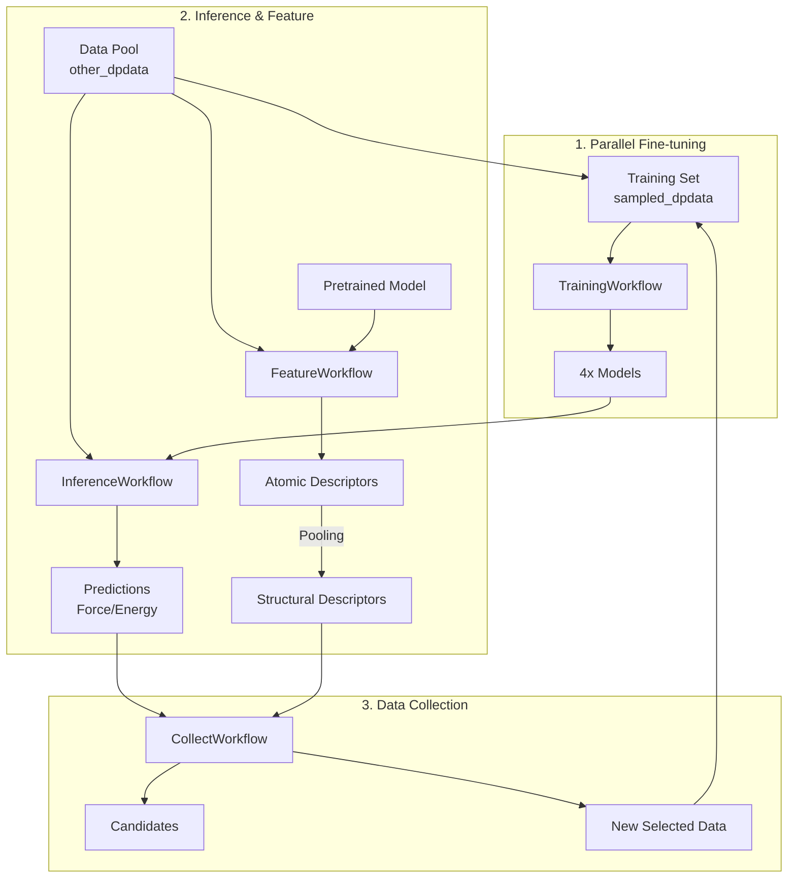

# DPEVA 工作流全链路重构方案

## 1. 现状与痛点分析

当前 DPEVA 项目已经实现了基于不确定度和特征采样的核心筛选逻辑（`collect` 模块），但整个主动学习闭环的其他关键环节——并行微调、推理预测、特征提取——仍然散落在 `utils/` 目录下的独立脚本中。

**痛点：**
*   **割裂的工作流**：`dptrain`, `dptest`, `dpdesc` 与 `collect` 之间缺乏统一的接口和数据流转机制，依赖人工手动执行和文件传递。
*   **低复用性**：核心逻辑（如并行训练的配置管理、DeepPot 的调用）耦合在脚本中，难以被其他模块调用。
*   **维护困难**：脚本化的代码缺乏模块化封装，难以进行单元测试和统一的错误处理。

## 2. 重构目标

基于 **Zen of Python** (Explicit is better than implicit, Flat is better than nested)，将 DPEVA 重构为一个**全链路、模块化、可编程**的主动学习框架。

**核心目标：**
1.  **全流程模块化**：将训练、推理、特征提取逻辑全部封装进 `src/dpeva` 库。
2.  **统一工作流**：在 `src/dpeva/workflows` 下建立对应的高层工作流类，实现标准化的调用接口。
3.  **清晰的数据流**：明确各模块间的输入输出契约，减少隐式依赖。

## 3. 架构设计

我们将 DPEVA 的功能划分为四个核心子系统，每个子系统包含底层功能模块（Mechanisms）和高层工作流（Policies）。

### 3.1 模块划分

| 现有脚本 (`utils/`) | 功能域 | 新增核心模块 (`src/dpeva/`) | 新增工作流 (`src/dpeva/workflows/`) |
| :--- | :--- | :--- | :--- |
| `dptrain/` | **并行微调** | `training/`   (`ParallelTrainer`) | `train.py`   (`TrainingWorkflow`) |
| `dptest/` | **推理评估** | `inference/`   (`ModelEvaluator`) | `infer.py`   (`InferenceWorkflow`) |
| `dpdesc/` | **特征提取** | `feature/`   (`DescriptorGenerator`) | `feature.py`   (`FeatureWorkflow`) |
| `uq/` (已重构) | **数据采集** | `uncertain/`, `sampling/` | `collect.py`   (`CollectWorkflow`) |
| `dataset_tools/`   (原 `utils/collect`) | **数据工具** | `io/` (增强) | (辅助工具) |

### 3.2 详细设计

#### A. 并行微调系统 (`training`)
*   **职责**：管理多模型（Ensemble）的并行训练过程。
*   **核心类 `ParallelTrainer`**:
    *   `setup_workdirs()`: 创建 `0/`, `1/`, `2/`, `3/` 目录。
    *   `prepare_configs(base_config, seeds)`: 为每个模型生成独立的 `input.json`，确保随机种子各异。
    *   `train(blocking=True)`: 调用 `dp train` 启动训练（支持子进程并发）。

#### B. 推理评估系统 (`inference`)
*   **职责**：使用训练好的模型群对未标注数据进行预测。
*   **核心类 `ModelEvaluator`**:
    *   `predict_ensemble(data_path, models)`: 批量运行 4 个模型的推理。
    *   `parse_results()`: 将 `dp test` 的输出解析为内存友好的格式（或统一的 NumPy/HDF5 文件），供 UQ 计算使用。

#### C. 特征提取系统 (`feature`)
*   **现状分析** (`utils/dpdesc/`):
    *   `gen_desc.py`: 核心脚本，生成**原子级**描述符。这是工作流的基础。
    *   `gen_desc_stru.py`: 变体脚本，生成**结构级**描述符（即原子描述符的池化/平均）。
    *   `check_desc_len.py`: 调试工具，用于数据一致性检查。
    *   `pca_desc_stru.py`, `tsne_cuml_stru.py`: 可视化工具。
*   **重构策略**:
    *   **核心类 `DescriptorGenerator`**:
        *   `load_model(model_path)`: 加载模型。
        *   `compute_atomic_descriptors(systems)`: 对应 `gen_desc.py`，计算原子特征。
        *   `compute_structural_descriptors(systems, pooling='mean')`: 对应 `gen_desc_stru.py`，直接计算结构特征（支持 mean/max/sum 池化）。
    *   **可视化类 `FeatureVisualizer`** (可选):
        *   封装 PCA/t-SNE 绘图逻辑，便于复用。

#### D. 主动学习采集系统 (`collect` - 已完成)
*   **职责**：基于 UQ 和特征进行数据筛选。
*   **核心类 `CollectWorkflow`** (原 `ActiveWorkflow`):
    *   集成 `UQCalculator`, `UQFilter`, `DIRECTSampler`。
    *   入口脚本：`utils/run_collect_workflow.py`。

#### E. 数据集工具 (`dataset_tools`)
*   包含辅助脚本（如 `dpdata_addtrain.py`），用于快速合并数据集等操作。此类脚本保持独立，按需调用。

## 4. 数据流图 (Data Flow)

## 5. 实施路线图

### Phase 1: 基础模块封装
1.  **Feature**: 实现 `src/dpeva/feature`，封装 `DeepPot` 调用。支持原子级和结构级两种输出模式，涵盖 `gen_desc.py` 和 `gen_desc_stru.py` 的功能。
2.  **Training**: 实现 `src/dpeva/training`，封装 `input.json` 处理和多进程训练逻辑。
3.  **Inference**: 实现 `src/dpeva/inference`，封装 `dp test` 调用和结果解析。

### Phase 2: 工作流构建
1.  在 `src/dpeva/workflows` 下创建 `feature.py`, `train.py`, `infer.py`。
2.  确保每个 Workflow 都有统一的配置接口（Config-driven）。
3.  确认 `collect.py` 与其他模块的接口兼容性。

### Phase 3: 集成与验证
1.  编写集成测试脚本，串联运行 `Train -> Infer -> Feature -> Collect` 全流程。
2.  验证数据流转的正确性（如 `sampled_dpdata` 是否被正确更新）。

## 6. 预期成果

*   **代码库**：`src/dpeva` 成为功能完备的主动学习库。
*   **使用方式**：用户可以通过简单的 Python 脚本或配置文件驱动整个主动学习循环，而不再需要手动运行 shell 脚本。
*   **扩展性**：未来支持新的 UQ 方法或采样策略时，只需扩展相应的底层模块，不影响整体工作流架构。
