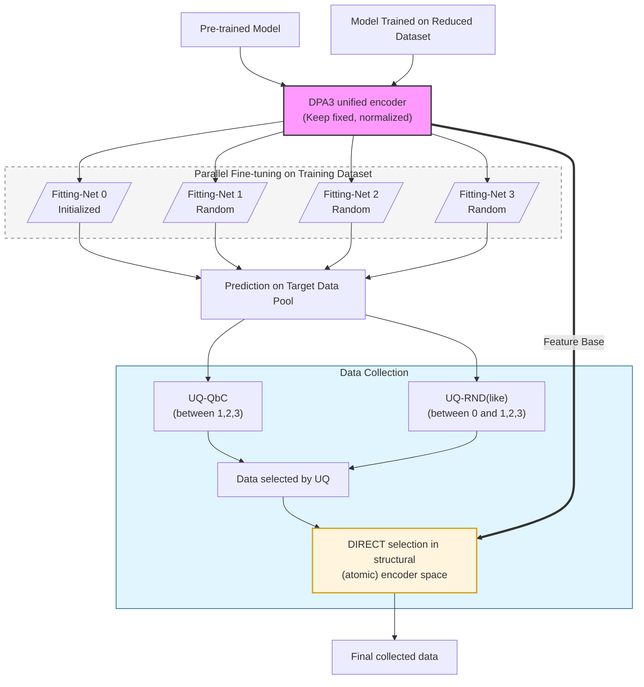

```mermaid
graph TD
    %% DPEVA Workflow v0.2.2 in Mermaid
    %% 节点定义
    Node0["Pre-trained Model"]
    Node4["Model Trained on Reduced Dataset"]
    Node11["DPA3 unified encoder<br/>(Keep fixed, normalized)"]
    
    %% 子图 1：模型训练阶段
    subgraph Training_Phase ["Parallel Fine-tuning on Training Dataset"]
        Node15[/Fitting-Net 0<br/>Initialized/]
        Node16[/Fitting-Net 1<br/>Random/]
        Node17[/Fitting-Net 2<br/>Random/]
        Node18[/Fitting-Net 3<br/>Random/]
    end

    Node27["Prediction on Target Data Pool"]
    
    %% 子图 2：数据筛选与采集
    subgraph Data_Collection ["Data Collection"]
        direction TB
        Node35["UQ-QbC<br/>(between 1,2,3)"]
        Node37["UQ-RND(like)<br/>(between 0 and 1,2,3)"]
        Node39["Data selected by UQ"]
        Node51["DIRECT selection in structural<br/>(atomic) encoder space"]
        
        %% 子图内部逻辑
        Node35 & Node37 --> Node39
        Node39 --> Node51
    end

    Node46["Final collected data"]

    %% 全局连接逻辑
    Node0 & Node4 --> Node11
    Node11 --> Node15
    Node11 --> Node16
    Node11 --> Node17
    Node11 --> Node18
    
    Node15 & Node16 & Node17 & Node18 --> Node27
    Node27 --> Node35
    Node27 --> Node37
    
    %% 关键连接：基于 DPA3 特征空间进行 DIRECT 筛选
    Node11 ==>|Feature Base| Node51
    Node51 --> Node46

    %% 样式美化
    style Node11 fill:#f9f,stroke:#333,stroke-width:2px
    style Node51 fill:#fff4dd,stroke:#d4a017,stroke-width:2px
    style Training_Phase fill:#f5f5f5,stroke:#666,stroke-dasharray: 5 5
    style Data_Collection fill:#e1f5fe,stroke:#01579b
```