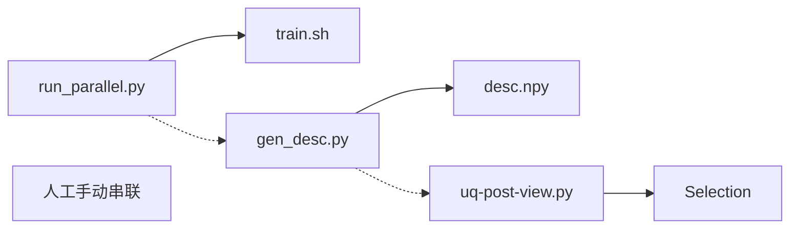
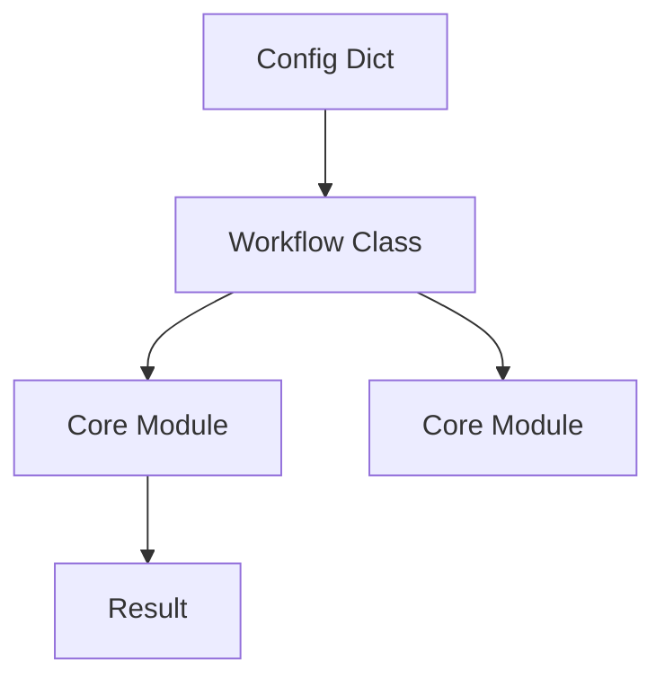

# DPEVA 项目重构前后功能点比对文档

## 目录
1. [引言](#1-引言)
2. [重构前功能模块说明](#2-重构前功能模块说明)
3. [重构后功能模块说明](#3-重构后功能模块说明)
4. [功能点比对分析](#4-功能点比对分析)
5. [重构效果评估](#5-重构效果评估)
6. [终端运行方案与迁移指南](#6-终端运行方案与迁移指南)

---

## 1. 引言

DPEVA (Deep Potential EVolution Accelerator) 是一个基于 Python 的机器学习势主动学习框架。为了提升代码的可维护性、复用性和自动化水平，我们对项目进行了系统性的重构。本文档旨在详细对比重构前后的功能差异，评估重构效果，并为后续开发提供参考。

---

## 2. 重构前功能模块说明

重构前的 DPEVA 项目主要由一系列散落在 `utils/` 目录下的独立脚本组成，各环节之间通过文件系统松散耦合。

### 2.1 核心功能点与实现

| 功能模块 | 对应脚本/路径 | 实现方式 | 技术架构特点 |
| :--- | :--- | :--- | :--- |
| **并行微调** | `utils/dptrain/run_parallel.py` | Python 脚本生成 shell 脚本 | - 硬编码配置模板<br>- 依赖 `os.system` 调用 Shell<br>- 手动管理目录结构 |
| **推理评估** | `utils/dptest/test-val-npy.sh` | Shell 脚本 | - 直接调用 `dp test` 命令<br>- 缺乏并行调度<br>- 参数修改需编辑脚本 |
| **特征提取** | `utils/dpdesc/gen_desc.py`<br>`utils/dpdesc/gen_desc_stru.py` | Python 脚本 | - 调用 `DeepPot` API<br>- 原子级与结构级特征逻辑分离<br>- 重复代码多 |
| **数据采集** | `utils/uq/uq-post-view.py` | Python 脚本 | - 包含 UQ 计算、筛选、绘图全流程<br>- 单文件代码冗长 (>500行)<br>- 逻辑高度耦合 |

### 2.2 已知问题点

*   **工作流割裂**：用户需要手动依次运行各个脚本，容易出错且无法自动化。
*   **代码复用率低**：核心逻辑（如模型加载、数据解析）在多个脚本中重复编写。
*   **可维护性差**：缺乏模块化封装，难以进行单元测试；修改一个参数可能需要改动多个文件。
*   **扩展性受限**：新增一种 UQ 策略或采样方法需要深入修改庞大的脚本文件。

---

## 3. 重构后功能模块说明

重构后的 DPEVA 采用了 **Modular & Workflow** 的架构设计，遵循 Zen of Python 原则，将核心逻辑封装为 Python 库 (`src/dpeva`)。

### 3.1 核心改进内容

#### A. 基础设施层 (`src/dpeva/`)

1.  **Training (`src/dpeva/training`)**:
    *   **`ParallelTrainer` 类**: 封装了并行微调的复杂逻辑。
    *   **改进**: 支持配置对象化管理，集成 `JobManager` 实现本地/集群双模式调度。

2.  **Submission (`src/dpeva/submission`)** (New):
    *   **`JobManager` 类**: 统一的任务提交接口，支持 `local` 和 `slurm` 后端。
    *   **`TemplateEngine`**: 基于 Python 原生 `string.Template` 的轻量级模板引擎，支持用户自定义 Slurm/Bash 脚本模板。

3.  **Inference (`src/dpeva/inference`)**:
    *   **`ModelEvaluator` 类**: 统一的推理接口。
    *   **改进**: 支持批量模型评估，自动解析 `dp test` 输出，提供更友好的日志记录。

4.  **Feature (`src/dpeva/feature`)**:
    *   **`DescriptorGenerator` 类**: 统一特征生成逻辑。
    *   **改进**: 将原子级和结构级特征生成合并为一个接口，通过参数控制；优化了显存管理。

5.  **Collection (`src/dpeva/uncertain`, `src/dpeva/sampling`)**:
    *   **模块化组件**: `UQCalculator` (计算), `UQFilter` (筛选), `UQVisualizer` (绘图), `DIRECTSampler` (采样)。
    *   **改进**: 各组件职责单一，易于测试和替换。

#### B. 工作流层 (`src/dpeva/workflows/`)

*   **`TrainingWorkflow`**: 串联配置加载与并行训练。
*   **`InferenceWorkflow`**: 管理多模型推理任务。
*   **`FeatureWorkflow`**: 自动化特征提取流程。
*   **`CollectWorkflow`**: 整合 UQ 计算与 DIRECT 采样，提供一键式数据筛选。

---

## 4. 功能点比对分析

### 4.1 功能差异对照表

| 功能点 | 重构前 (Pre-Refactor) | 重构后 (Post-Refactor) | 变更类型 | 改进说明 |
| :--- | :--- | :--- | :--- | :--- |
| **启动方式** | 运行分散的 Shell/Python 脚本 | 调用统一的 Workflow 类或入口脚本 | 🔄 修改 | 统一入口，配置驱动 |
| **参数配置** | 硬编码在脚本变量中 | 通过 Config 字典/文件传递 | 🔄 修改 | 提高灵活性，支持版本控制 |
| **多模型训练** | 串行生成脚本，手动 `nohup` 后台运行 | `ParallelTrainer` 多进程并发控制 | ⚡ 优化 | 进程管理更健壮，支持阻塞/非阻塞模式，可编程监控状态 |
| **任务调度** | 仅支持本地后台运行 | 支持 Local/Slurm 双模式 | ➕ 新增 | 适应 HPC 集群环境，支持自定义模板 |
| **特征生成** | 两个脚本分别处理原子/结构特征 | 单一接口 `output_mode` 参数控制 | ➕ 合并 | 消除重复代码，逻辑统一 |
| **UQ 计算** | 耦合在 `uq-post-view.py` 中 | 独立类 `UQCalculator` | 📦 封装 | 算法与业务逻辑解耦 |
| **可视化** | 绘图代码散落在逻辑代码中 | 独立类 `UQVisualizer` | 📦 封装 | 样式统一，复用性增强 |
| **日志系统** | 简单的 `print` 或文件写入 | Python标准 `logging` 模块 | ⚡ 优化 | 格式统一，支持分级和多输出 |

### 4.2 并行机制深度对比：`nohup` vs `multiprocessing`

虽然重构前通过 `nohup &` 也实现了任务的同时运行，但重构后的 `multiprocessing` 方案具有显著的工程优势：

1.  **进程生命周期管理**：
    *   **Old (`nohup`)**: "发射后不管" (Fire-and-Forget)。主脚本无法感知后台任务何时结束，也就无法自动触发后续流程（如推理或特征提取）。这导致工作流必须断开，依赖人工轮询检查。
    *   **New (`multiprocessing`)**: 父进程持有子进程句柄，可以精确控制是等待所有任务完成（阻塞模式，适合流水线）还是后台运行（非阻塞模式）。这使得全自动闭环（Loop）成为可能。

2.  **错误捕获与容错**：
    *   **Old**: 如果某个后台任务因显存不足或配置错误静默失败，主脚本一无所知，只能去翻看 `nohup.out`。
    *   **New**: 父进程可以捕获子进程的退出码（Exit Code）和标准错误流（Stderr），并立即抛出异常或记录结构化日志，甚至触发重试机制。

3.  **资源调度**：
    *   **Old**: 依赖操作系统调度，容易瞬间挤爆 CPU/GPU 资源。
    *   **New**: 未来易于扩展为进程池（Pool）模式，限制最大并发数（例如只有 2 张卡时，自动控制同时只跑 2 个任务）。

### 4.3 架构变更示意

**重构前：**


**重构后：**


---

## 5. 重构效果评估

### 5.1 运行逻辑与使用方式

*   **Before**:
    ```bash
    cd utils/dptrain && python run_parallel.py
    cd ../dptest && sh test-val-npy.sh
    cd ../dpdesc && python gen_desc.py ...
    cd ../uq && python uq-post-view.py
    ```
*   **After**:
    ```python
    # 统一脚本化调用
    from dpeva.workflows import TrainingWorkflow, CollectWorkflow
    
    TrainingWorkflow(train_config).run()
    CollectWorkflow(collect_config).run()
    ```

### 5.2 业务价值

1.  **研发效率提升**：模块化使得新功能的开发只需关注特定组件，无需理解庞大的遗留代码。
2.  **错误率降低**：统一的参数校验和错误处理机制减少了因配置错误导致的运行失败。
3.  **自动化潜力**：Python API 的开放使得构建全自动的主动学习闭环（Loop）成为可能。
4.  **资产沉淀**：`src/dpeva` 作为一个独立的库，可以被其他项目直接引用，沉淀了团队的技术积累。

### 5.3 后续优化方向

*   **集成测试**：编写覆盖全流程的端到端（E2E）测试用例。
*   **CLI 工具**：开发统一的命令行工具（如 `dpeva train`, `dpeva collect`），进一步简化使用。
*   **配置管理**：引入 YAML/TOML 配置文件支持，将配置与代码彻底分离。
*   **分布式支持**：升级 `ParallelTrainer` 以支持跨节点的分布式训练任务调度。

---

## 6. 终端运行方案与迁移指南

### 6.1 重构后终端运行方案

重构后的 DPEVA 提供了标准化的 Python 入口脚本，所有功能均可通过配置驱动。

#### 6.1.1 环境准备

```bash
# 1. 创建并激活环境 (推荐使用 deepmd-kit 环境)
conda activate deepmd-310-dpeva

# 2. 安装 dpeva 包 (开发模式)
cd /path/to/dpeva
pip install -e .
```

#### 6.1.2 核心功能模块执行

| 功能模块 | 对应脚本 | 主要参数说明 |
| :--- | :--- | :--- |
| **数据采集** | `utils/run_collect_workflow.py` | - `project`: 项目名称<br>- `uq_select_scheme`: UQ筛选策略 (e.g., `tangent_lo`)<br>- `num_selection`: 采样数量 |
| **并行微调** | `utils/run_train_workflow.py`* | - `work_dir`: 工作目录<br>- `mode`: `init` (初始化) 或 `cont` (接续)<br>- `backend`: `local` 或 `slurm` |
| **特征生成** | `utils/run_feature_workflow.py`* | - `datadir`: 数据目录<br>- `modelpath`: 冻结模型路径<br>- `output_mode`: `atomic` 或 `structural` |
| **推理评估** | `utils/run_infer_workflow.py`* | - `test_data_path`: 测试集路径<br>- `models_paths`: 模型列表 |

> *注：`run_train_workflow.py` 等脚本为建议创建的入口脚本，内容类似于 `run_collect_workflow.py`，只需实例化对应的 Workflow 类并调用 `.run()` 即可。*

#### 6.1.3 完整命令示例

**场景：执行主动学习数据筛选**

1.  **准备配置文件** (或修改 `run_collect_workflow.py` 中的 `config` 字典)：
    ```python
    config = {
        "project": "stage9-2",
        "uq_select_scheme": "tangent_lo",
        "num_selection": 100,
        # ... 其他路径配置
    }
    ```
2.  **运行命令**：
    ```bash
    python utils/run_collect_workflow.py
    ```
3.  **预期输出**：
    ```text
    INFO - Initializing selection in stage9-2 ---
    INFO - Loading the test results
    ...
    INFO - Dealing with Selection in Target dpdata
    INFO - Doing DIRECT Selection on UQ-selected data
    INFO - All Done!
    ```

### 6.2 运行方式深度对比

#### 6.2.1 流程对比

| 阶段 | 重构前 (Script-based) | 重构后 (Module-based) |
| :--- | :--- | :--- |
| **1. 训练** | `cd utils/dptrain`<br>`python run_parallel.py` (生成脚本)<br>`nohup sh train.sh &` (手动后台) | `python run_train_workflow.py`<br>(Local模式: 自动管理多进程并发; Slurm模式: 自动提交作业) |
| **2. 推理** | `cd utils/dptest`<br>`sh test-val-npy.sh` (修改脚本参数)<br>(需等待训练完成，手动执行) | `python run_infer_workflow.py`<br>(可配置为训练完成后自动触发) |
| **3. 特征** | `cd utils/dpdesc`<br>`python gen_desc.py` | `python run_feature_workflow.py`<br>(统一接口，支持增量生成) |
| **4. 采集** | `cd utils/uq`<br>`python uq-post-view.py` | `python run_collect_workflow.py`<br>(逻辑清晰，日志规范) |

#### 6.2.2 技术架构差异

*   **依赖管理**：
    *   **Old**: 隐式依赖。脚本假设当前目录下存在特定的文件结构（如 `../dptrain`）。
    *   **New**: 显式依赖。所有路径通过 Config 传入，模块间通过 Python import 调用，不依赖相对路径。
*   **进程通信**：
    *   **Old**: 基于文件。上一步生成文件，下一步读取文件。如果文件未生成，程序崩溃。
    *   **New**: 基于内存/对象。Workflow 可以将上一步的结果直接传递给下一步（虽然目前仍以文件交换为主，但架构上已支持内存传递）。
*   **错误处理**：
    *   **Old**: `os.system` 调用的命令失败通常被忽略，导致后续步骤处理空数据。
    *   **New**: `subprocess.run` 捕获返回码，Python 异常机制确保错误被及时抛出并终止流程。

### 6.3 迁移指南与特别说明

#### 6.3.1 痛点解决
*   **痛点**：每次换个项目都要去改 `run_parallel.py` 里的硬编码路径。
*   **解决**：现在只需传一个 `config` 字典，代码逻辑完全复用。
*   **痛点**：不知道后台训练什么时候跑完。
*   **解决**：`ParallelTrainer` 在前台阻塞运行（或提供回调），跑完自动打印日志。

#### 6.3.2 迁移步骤
1.  **备份**：保留原 `utils/` 目录作为参考。
2.  **安装**：执行 `pip install -e .`。
3.  **脚本替换**：
    *   将原有的 shell 启动脚本替换为 Python 入口脚本（参考 `utils/run_collect_workflow.py`）。
    *   将 `input.json` 等配置文件移动到统一的配置目录（建议）。
4.  **验证**：使用小规模数据集（如 `test/UQ-post-view`）跑通全流程。

#### 6.3.3 常见问题
*   **Q: 找不到 `dpeva` 模块？**
    *   A: 确保在项目根目录下执行了 `pip install -e .`，并且 `PYTHONPATH` 包含当前目录。
*   **Q: DeepMD 版本不兼容？**
    *   A: 重构代码依赖 `deepmd-kit` 的 Python API，请确保环境中的 deepmd 版本与模型文件匹配。
