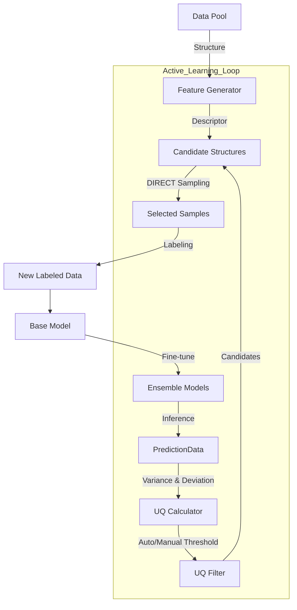

# DP-EVA 项目开发文档

- Status: active
- Audience: Developers
- Last-Updated: 2026-02-18
- Related:
  - 配置字段字典：/docs/reference/config-schema.md
  - 校验规则补充：/docs/reference/validation.md

* **版本**: 0.4.4
* **生成日期**: 2026-02-27
* **作者**: Quantum Misaka with Trae SOLO

---

## 1. 项目概述 (Overview)

### 1.1 项目简介
DP-EVA (Deep Potential EVolution Accelerator) 是一个面向 DPA3 (Deep Potential v3) 高效微调的自动化主动学习框架。该项目旨在通过智能化的数据筛选策略，从海量无标签数据中识别出最具价值的样本（高模型不确定度 + 高结构代表性），从而以最小的数据标注成本实现模型性能的最大化提升。

### 1.2 核心哲学 (The Zen of DP-EVA)
本项目遵循 Python 工程化最佳实践及 **Zen of Python** 哲学进行重构与维护：

#### 1.2.1 核心原则
*   **明确与简洁 (Explicit & Simple)**：优先选择清晰直观的实现，拒绝隐晦的技巧与魔法（如环境变量隐式控制）。
*   **可读性至上 (Readability Counts)**：代码首先是写给人看的。命名、缩进、结构需一目了然。
*   **实用与优雅 (Practicality Beats Purity)**：在理想设计与现实需求冲突时，选择实用方案；优雅是指恰到好处的平衡。
*   **一种最好 (There Should Be One Obvious Way to Do It)**：面对问题应有唯一明显的解决方案，避免提供多个功能重叠的接口。
*   **宽容但不纵容 (Errors Should Never Pass Silently)**：错误必须被显式捕获和处理，允许失败但必须给出清晰的异常信息。

#### 1.2.2 架构实践
*   **模块解耦 (Modular Design)**：将复杂的科研脚本拆解为职责单一的原子模块 (Training, Inference, Uncertainty, Sampling)。
*   **领域驱动设计 (Domain-Driven Design)**：v2.8.0+ 引入了领域驱动架构，将核心工作流拆分为 IO、Config、Execution 等独立服务层，大幅降低耦合度。
*   **数据标准化 (Data Standardization)**：引入标准化的 `PredictionData` 接口，替代不透明的遗留对象。
*   **双模调度 (Dual-Mode Scheduling)**：底层统一封装 `JobManager`，无缝支持 Local (Multiprocessing) 和 Slurm 集群环境。
*   **日志规范 (Logging Discipline)**：库代码不干预全局日志配置，确保日志输出清晰、无冗余且易于追踪。
*   **职责边界 (Boundary of Responsibility)**：上层业务逻辑（如 Joint Sampling 的数据切分）应收敛于 Manager/Service 层，严禁侵入式修改底层通用算法模块（如 `DIRECTSampler`）。保持底层模块的纯洁性与通用性（Ref: v0.4.2 n_candidates fix）。

### 1.3 优化方向与路线图 (Roadmap)
基于 Code Review 的建议，项目后续将重点关注以下方向：
1.  **全链路 DDD 重构**：目前 Training, Collection, Inference 模块已完成 DDD 改造，后续需将 Feature 模块迁移至相同架构 (IO/Config/Execution Managers)。
2.  **统一配置管理**：进一步强化 Pydantic 在所有配置类中的应用，消除字典传递，确保类型安全。
3.  **测试覆盖率**：提升集成测试的覆盖范围，特别是针对 Slurm 提交和异常处理的边界测试。
4.  **遗留代码清理**：逐步移除标记为 Deprecated 的单体类 (`ParallelTrainer` 等)，保持代码库轻量化。

### 1.4 开发流程标准 (Development Process Standard)
为确保代码质量与知识沉淀，所有开发活动必须严格遵循以下标准流程：

1.  **计划 (Plan)**: 
    *   在开始编码前，必须基于现状进行需求分析与技术方案设计。
    *   对于重大重构或新功能，需编写简要的 RFC (Request for Comments) 或 Design Doc。
2.  **执行 (Execute)**:
    *   代码编写应遵循 **Zen of Python** 原则。
    *   优先使用领域驱动设计 (DDD) 模式，避免创建上帝类。
    *   保持提交粒度适中，Commit Message 清晰。
3.  **验证 (Verify)**:
    *   **必须** 编写或更新单元测试，确保覆盖核心逻辑。
    *   在提交前运行所有相关测试，确保无回归 (Regression)。
4.  **文档化 (Document)**:
    *   **强制要求**: 开发完成后，必须同步更新本文档 (`developer-guide.md`) 的相关章节（如架构图、接口变更）。
    *   **技术细节**: 将详细的实现细节、配置参数字典、算法推导等内容沉淀至 `docs/reference/` 或 `docs/guides/` 下的专项文档中。
    *   **废弃清理**: 及时标记并清理过时的文档与代码。


---

## 2. 系统架构 (Architecture)

### 2.1 目录结构
项目代码组织在 `src/dpeva` 包下，结构清晰：

```text
dpeva/
├── examples/recipes/       # [API范例] Python 调用示例 (Recipes)
│   ├── training/           # 训练脚本范例
│   ├── inference/          # 推理脚本范例
│   ├── collection/         # 采集脚本范例
│   └── ...
├── src/dpeva/
│   ├── cli.py              # [用户接口] 统一命令行入口 (dpeva)
│   ├── workflows/          # [核心] 业务流程编排层
│   │   ├── train.py        # 训练工作流 (TrainingWorkflow)
│   │   ├── infer.py        # 推理与分析工作流 (InferenceWorkflow)
│   │   ├── collect.py      # 数据采集工作流 (CollectionWorkflow) - 现已重构为编排器
│   │   └── feature.py      # 特征生成工作流 (FeatureWorkflow)
│   ├── services/           # [服务层] (概念上) 领域逻辑服务
│   │   ├── io.collection   # 数据IO服务 (CollectionIOManager)
│   │   ├── uncertain.manager # UQ编排服务 (UQManager)
│   │   └── sampling.manager  # 采样编排服务 (SamplingManager)
│   ├── training/           # 训练模块 (ParallelTrainer)
│   ├── inference/          # 推理模块 (StatsCalculator, Visualizer)
│   ├── uncertain/          # 不确定度模块 (UQCalculator, UQFilter, Visualizer)
│   ├── sampling/           # 采样模块 (DIRECT, PCA, Clustering)
│   ├── feature/            # 特征生成模块 (DescriptorGenerator)
│   ├── submission/         # 任务提交抽象层 (JobManager, JobConfig, Templates)
│   ├── io/                 # 数据读写辅助 (DPTestResultParser, PredictionData, types)
│   └── utils/              # 通用工具
└── test/                   # [开发专用] 单元测试与回归测试脚本
```

### 2.2 数据流图 (Data Flow)


---

## 3. 核心模块详解 (Modules)

### 3.1 Training 模块 (`dpeva.training`)
负责管理 DeepMD 模型的并行训练任务。
*   **`TrainingWorkflow`**: 核心编排类 (Orchestrator)。基于 DDD 模式重构，协调以下 Manager 完成任务：
    *   **`TrainingIOManager`**: 负责工作空间管理与文件操作。
    *   **`TrainingConfigManager`**: 负责配置解析与随机种子管理。
    *   **`TrainingExecutionManager`**: 负责命令构建与作业提交。
*   **`ParallelTrainer`**: (已过时/Deprecated) 遗留类，保留以维持向后兼容性。
*   **特性**:
    *   自动工作目录隔离 (`0/`, `1/`, `2/`, `3/`)。
    *   支持 `OMP_NUM_THREADS` 自动配置。
    *   内置随机种子循环机制，确保多模型多样性。

### 3.2 Inference 模块 (`dpeva.inference`)
负责模型批量推理及后续的误差分析。
*   **`InferenceWorkflow`**: 
    *   自动扫描模型目录并提交 `dp test` 任务。
    *   **高级分析**: 内置 `StatsCalculator`，自动计算 RMSE/MAE。
    *   **相对能量分析**: 支持通过最小二乘法 (Least Squares) 拟合原子能量，计算 Cohesive Energy，从而在不同组分体系间进行公平比较。
    *   **可视化**: 自动生成 Parity Plot (能量/力) 和误差分布图。

### 3.3 Uncertainty & Sampling 模块 (`dpeva.uncertain`, `dpeva.sampling`)
这是主动学习的大脑，负责从海量数据中“淘金”。
*   **数据标准化 (`io.types.PredictionData`)**: 
    *   取代了旧版的 `DPTestResults` 遗留类。
    *   统一使用 `PredictionData` (Dataclass) 作为数据容器，包含 `energy`, `force`, `virial` 等标准字段。
*   **UQ 计算 (`UQCalculator`)**: 
    *   **QbC (Query by Committee)**: 计算多模型预测方差。公式：$\sigma_{QbC} = \sqrt{\sum_{i=x,y,z} Var(F_i)}$。
    *   **RND (Random Network Distillation)**: 计算当前模型与参考模型的偏差。公式：$\sigma_{RND} = \sqrt{\sum_{i=x,y,z} Mean((F_i^{pred} - F_i^{base})^2)}$。
    *   **数值稳定性 (Robustness)**: 实现了 **"Clamp-and-Clean"** 策略：
        *   **Clamp**: 强制方差计算结果非负 (`np.maximum(var, 0.0)`)，消除浮点误差导致的 RuntimeWarning。
        *   **Clean**: 自动检测 `NaN` 输出并将其替换为 `Infinity`（最大不确定度），确保异常模型预测会被标记为 `Failed` 而非被忽略。
        *   **Robust Scaling**: 手动实现了抗 Inf 的 Robust Scaling 算法，仅基于有限值计算统计量，保留 `Inf` 的极端属性。
    *   **自动阈值 (Auto-Threshold)**: 基于 KDE (核密度估计) 自动识别不确定度分布峰值，自适应确定 `trust_lo`。
*   **筛选策略 (`UQFilter`)**: 支持 `strict`, `tangent`, `circle` 等多种 2D 边界筛选算法。
*   **DIRECT 采样 (`DIRECTSampler`)**: 
    *   **联合采样 (Joint Sampling)**: 支持同时加载训练集和候选集，在联合特征空间中进行覆盖度最大化采样，避免新样本与旧样本重复。
    *   **基于聚类**: 使用 BIRCH 聚类算法在 PCA 降维后的空间中寻找最具代表性的样本点。
    *   **归一化策略**: 对结构描述符（原子描述符均值）进行 **L2 归一化**，随后进行 Z-score 标准化。
*   **2-DIRECT 采样 (`TwoStepDIRECTSampler`)**:
    *   **两步策略**: 先基于结构描述符进行粗粒度聚类 (Step 1)，再对每个结构簇内的原子环境进行细粒度聚类 (Step 2)。
    *   **原子级筛选**: 在 Step 2 中支持基于原子数量 (`smallest`) 等策略选择最具代表性的结构，有效降低标注成本。
    *   **归一化策略 (Normalization)**:
        *   **Step 1 (Structure)**: 采用 L2 归一化 + Z-score 标准化。结构描述符通过对原子描述符取平均并进行 L2 归一化生成，保留了反映原子环境一致性的模长特征。
        *   **Step 2 (Atomic)**: 仅采用 Z-score 标准化，**不进行 L2 归一化**。实测表明，保留原子描述符的原始模长（蕴含局部环境复杂度信息）能显著提升聚类效果和最终模型性能。

### 3.4 Feature 模块 (`dpeva.feature`)
负责生成原子结构的描述符。
*   **`DescriptorGenerator`**:
    *   **CLI 模式**: 调用 `dp eval-desc` 命令，支持 Slurm 提交。
    *   **Python 模式**: 直接调用 `deepmd.infer` API，适合小规模或调试使用。
    *   **数据一致性**: 统一使用 `dpeva.io.dataset.load_systems` 加载数据，确保在 `mixed` 格式下与 CLI 模式行为一致。
    *   **单数据池兼容**: 智能识别 `desc_dir/System.npy` 格式的描述符文件，兼容单数据池模式下的平铺结构。
    *   **多数据池支持**: 递归支持 `Dataset/System` 3层结构，通过增强的路径解析逻辑确保描述符与数据一一对应。

### 3.5 Submission 模块 (`dpeva.submission`)
统一的任务提交抽象层。
*   **`JobManager`**: 屏蔽 Local/Slurm 差异。
*   **`JobConfig`**: 强类型的作业配置类，支持 Partition, QoS, GPUs 等 Slurm 高级参数。
*   **`TemplateEngine`**: 基于模板生成作业脚本，易于扩展和定制。

---

## 4. 接口使用指南 (Interface Guide)

本项目提供两种使用方式：**统一命令行 (CLI)**（推荐）和 **Python API**（高级定制）。

### 4.1 统一命令行 (CLI)
自 v2.6.0 起，项目引入统一的 `dpeva` 命令，支持子命令模式。

**安装**:
```bash
pip install -e .
# 验证安装
dpeva --help
```

**通用用法**:
```bash
dpeva <subcommand> <config_path>
```

#### 4.1.1 训练 (Train)
```bash
dpeva train config_train.json
```

#### 4.1.2 推理与分析 (Infer)
```bash
dpeva infer config_test.json
```

#### 4.1.3 数据采集 (Collect)
```bash
dpeva collect config_collect.json
```

#### 4.1.4 特征生成 (Feature)
```bash
dpeva feature config_feature.json
```

#### 4.1.5 分析 (Analysis)
```bash
dpeva analysis config_analysis.json
```

### 4.2 Python API (Recipes)
对于需要动态生成配置或集成到复杂 Python 流程中的场景，可以直接调用 `dpeva.workflows` 中的 Workflow 类。
示例脚本位于 `examples/recipes/` 目录下。

**示例 (Training)**:
```python
from dpeva.workflows.train import TrainingWorkflow
from dpeva.utils.config import resolve_config_paths
import json

# 1. 加载配置
with open("config.json") as f:
    config = json.load(f)
config = resolve_config_paths(config, "config.json")

# 2. 初始化并运行
workflow = TrainingWorkflow(config)
workflow.run()
```

### 4.3 配置参数说明
详细的输入参数定义、类型约束及验证规则，请参阅 API 文档：

*   **参数列表**: [config-schema.md](/docs/reference/config-schema.md)
*   **验证规则**: [validation.md](/docs/reference/validation.md)

以下仅展示标准 JSON 配置文件的基本结构概览。

#### 4.3.1 训练配置 (Train Config)
**参考文件**: `examples/recipes/training/config_train.json`
```json
{
    "project": "./training_task",
    "base_model_path": "frozen_model.pb",
    "num_models": 4,
    "training_mode": "cont",
    "model_head": "ferro",
    "input_json_path": "input.json",
    "training_data_path": "data",
    "submission": {
        "backend": "local",
        "omp_threads": 4
    }
}
```

#### 4.3.2 其他配置
请参考 `examples/recipes/` 目录下的示例文件以及上述 API 文档。

---

### 4.4 UQ 与采样配置要点

本节补充 UQ 与采样相关的关键配置语义；完整字段列表与约束以 `/docs/reference/*` 为准。

#### 4.4.1 `uq_trust_mode` 配置说明

- `auto`：自动计算信任区边界（推荐默认）
- `manual`：手动指定信任区边界（需提供对应阈值参数）
- `no_filter`：不启用信任区筛选

参考：

- `/docs/reference/config-schema.md`
- `/docs/reference/validation.md`

#### 4.4.2 Auto-UQ 边界控制 (`uq_auto_bounds`)

Auto-UQ 用于根据数据分布自动确定筛选边界；具体的字段与约束以 Reference 文档为准，并在后续迭代中建议沉淀为独立章节以避免与算法实现脱节。

参考：

- `/docs/reference/config-schema.md`
- `/docs/reference/validation.md`

#### 4.4.3 采样参数说明 (Sampling)

采样相关参数（DIRECT/2-direct/joint 等）属于收集工作流的核心可调维度，建议：

- 只在 `/docs/reference/config-schema.md` 维护字段字典与默认值
- 在指南中仅描述“如何选择参数组”的经验规则，并引用对应字段

参考：

- `/docs/reference/config-schema.md`

## 5. 开发与测试 (Development)

### 5.1 代码规范
*   **日志**: 禁止在 `src/dpeva` 库文件中调用 `logging.basicConfig()`。仅在 `runner` 脚本中配置全局日志。
*   **路径**: 所有文件操作应使用绝对路径 (`os.path.abspath`)。
*   **异常**: 显式捕获并记录异常，避免静默失败。
*   **数据接口**: 使用 `dpeva.io.types.PredictionData` 传递预测结果，禁止传递裸字典。
*   **变量命名**: 统一输入数据路径变量名为 `data_path` (Feature/Inference Workflow)。

### 5.2 验证测试

在开发阶段，你可以通过`conda activate dpeva-dev` 加载所需环境，并在项目目录下运行 `pip install --upgrade .` 更新开发依赖，确保测试环境与开发环境保持一致。

用户自行开展单元测试时，需要自行配置好 Python 环境，确保 `dpeva` 命令在环境内并处于最新状态，且 `pytest` 已安装。

*   **运行单元测试 (Unit Tests)**:
    ```bash
    # 基础运行
    pytest tests/unit
    
    # 带覆盖率报告的运行 (推荐)
    pytest tests/unit --cov=dpeva --cov-report=term-missing
    ```
    *   **规范**:
        *   **Mock 外部依赖**: 所有对 `dp`, `dpdata`, `slurm` 的调用必须被 Mock，严禁在单元测试中产生实际的文件 I/O 或进程提交。
        *   **日志验证**: 涉及日志输出的逻辑，需验证 `setup_workflow_logger` 是否被正确调用。
        *   **异常覆盖**: 必须覆盖所有 `try-except` 分支，确保异常被正确捕获和记录。
    *   **覆盖范围**: 核心算法 (UQCalculator, UQFilter, DIRECTSampler) 的逻辑验证。
    *   **测试策略**: 
        *   **Golden Value**: 与 NumPy 手算结果比对，误差容忍度 < 1e-5。
        *   **边界测试**: 覆盖 NaN, Inf, 空数据, 单点数据等极端场景。
        *   **覆盖率要求**: 核心模块行覆盖率需达到 100%。

*   **运行兼容性测试 (Compatibility Test)**:
    ```bash
    cd test
    python run_compat_test.py
    ```
    此脚本会自动验证单数据池 (Single Pool) 和多数据池 (Multi Pool) 在普通模式与联合模式下的运行正确性。
    *   **描述符一致性**: 已通过 `verify_desc_consistency.py` 验证 CLI 模式下 NPY/Mixed 格式生成结果的一致性 (Diff < 1e-5)。

*   **运行 Auto-UQ 测试**:
    ```bash
    cd test/verification_test_run
    python run_auto_uq_test.py
    ```
    验证 KDE 阈值计算逻辑及可视化图表。

### 5.3 常见问题 (FAQ)

**Q: 单数据池模式下提示 "Found descriptor via basename fallback" 是什么意思？**
A: 旧版本会产生此 Warning，**新版本 (v2.2.0)** 已将其优化为 Info 级别的兼容性提示。这表示系统自动通过 `System.npy` 文件名匹配到了嵌套在 `Dataset/System` 路径下的结构数据，属于正常行为。

**Q: 为什么联合采样导出的样本数少于 `direct_n_clusters`？**
A: 这是预期行为。在联合模式下，`direct_n_clusters` 定义的是特征空间的总覆盖目标。如果某些区域已经被现有训练集覆盖，DIRECT 算法就不会再重复采样，从而节省标注成本。

### 5.4 工作流监控标准 (Workflow Monitoring)

为了支持自动化工作流编排（如使用 Airflow 或自定义 Scheduler），本项目统一了任务完成的日志标记。所有核心 Workflow 在成功执行完毕后，均会在标准输出或日志文件末尾打印以下 Tag：

```text
DPEVA_TAG: WORKFLOW_FINISHED
```

**监控建议**:
*   外部调度系统应通过 `grep` 或正则表达式持续监控任务的 Log 文件（如 `train.log`, `collection.log`, `eval_desc.log` 或 Slurm `.out` 文件）。
*   一旦检测到该 Tag，即可判定当前步骤已从应用层逻辑上成功结束，可以安全触发后续任务。

---

## 6. 版本修订记录 (Revision History)

*   **v2.1.0** (2026-01-28): 初始重构版本，引入 Auto-UQ 和模块化架构。
*   **v2.2.0** (2026-01-30): 
    *   **[新增]** 联合采样 (Joint Sampling) 功能支持，允许同时加载训练集进行去重采样。
    *   **[优化]** 单数据池描述符加载逻辑，消除 Fallback Warning，提升为兼容模式。
*   **v2.3.0** (2026-01-31):
    *   **[重构]** 废弃并移除 `DPTestResults` 遗留类，引入标准化的 `PredictionData` 接口。
    *   **[架构]** 实现了 `UQCalculator` 与特定数据格式的解耦，提升了系统的可维护性和扩展性。
    *   **[清理]** 移除了所有 deprecated 警告，修复了辅助工具脚本 (`utils/uq/`) 的兼容性问题。
    *   **[合并]** 整合了多数据池支持、UQ 参数优化、变量名标准化及描述符一致性验证等技术文档。
*   **v2.4.0** (2026-02-01):
    *   **[性能]** 深度优化 `CollectionWorkflow`，将导出循环复杂度从 O(N*M) 降至 O(N)，并在多数据池场景下实现 **2.2x - 5x** 的提速。
    *   **[功能]** 增强数据导出逻辑，现在能精确保持原始的多数据池目录结构 (`Pool/System`)，而不再强制合并。
    *   **[日志]** 引入 `_configure_file_logging`，确保 `CollectionWorkflow` 在标准 stderr 输出外，自动生成独立的 `collection.log` 运行日志。
    *   **[配置]** 移除了 redundant `testdata_fmt` 配置项，全面启用格式自动检测。
*   **v2.4.1** (2026-02-02):
    *   **[功能]** 引入 UQ Auto-Threshold 上下限控制 (`uq_auto_bounds`)。为 KDE 自动阈值算法增加了用户可配置的物理边界（Clamp机制），有效防止极端数据分布下产生过低或过高的不可信阈值，增强了主动学习流程的鲁棒性。
    *   **[机制]** 实现了 "Self-Invocation" (自调用) 模式的 Slurm 提交机制，彻底移除临时冻结配置文件 (`collect_config_frozen.json`) 和包装脚本的生成，提交逻辑更加优雅且易于维护。
*   **v2.4.2** (2026-02-02):
    *   **[规范]** 统一了四大核心 Workflow (Train, Infer, Collect, Feature) 的任务完成日志标识。无论 Backend 是 Local 还是 Slurm，所有 Worker 任务在成功结束时均会输出标准化的 `DPEVA_TAG: WORKFLOW_FINISHED` 标记，为自动化工作流监控和任务链编排提供了可靠的锚点。
*   **v2.5.0** (2026-02-04):
    *   **[重构]** 统一使用 `dpeva.io.dataset.load_systems` 函数加载结构数据，该函数内置了 `deepmd/npy/mixed` 优先的 Auto 格式检测策略，并自动修复 `dpdata` 加载时可能出现的原子名称重复问题。
    *   **[修复]** 解决了 Python Native 模式下计算 Mixed 格式描述符与 CLI 模式结果不一致的问题。通过 `load_systems` 将复杂的 MultiSystems 结构扁平化为独立的 System 列表，确保了与 CLI 模式一致的数据处理粒度。
    *   **[验证]** 在 Slurm 环境下对 CLI 模式和 Python 模式进行了严格的一致性验证，在 GPU 计算浮点误差范围内（Max Diff < 8e-4, Mean Diff ~ 1e-7），两者结果完全一致。
    *   **[配置]** `FeatureConfig` 移除了 `format` (或 `data_format`) 字段，系统现已全面统一为自动检测数据格式（`auto` 模式），极大简化了用户配置。旧配置文件中的该字段将被静默忽略，不影响兼容性。
*   **v2.6.0** (2026-02-04):
    *   **[架构]** 全面重构用户接口层，引入统一的 `dpeva` 命令行工具 (CLI)。
    *   **[重构]** 移除旧版 `runner/` 目录，将其重组为 `examples/recipes/`，提供纯 Python API 调用范例，实现核心逻辑与调用脚本的彻底解耦。
    *   **[功能]** 新增 `dpeva.cli` 模块，支持 `train`, `infer`, `collect`, `feature`, `analysis` 子命令。
    *   **[机制]** 优化 `CollectionWorkflow` 的自提交机制，现在通过 `python -m dpeva.cli collect` 触发 Slurm 作业，消除了对外部脚本路径的依赖。
*   **v2.7.0** (2026-02-05):
    *   **[功能]** 集成 **2-DIRECT** 采样策略，支持基于原子环境的两步聚类筛选，大幅降低标注成本。
    *   **[重构]** 彻底重构 DIRECT 采样参数体系：
        *   引入 `direct_n_clusters` 作为原生控制参数。
        *   移除 `num_selection` 参数。
        *   支持基于阈值的动态聚类模式（Advanced Mode）。
    *   **[配置]** 更新所有 Example Recipe 以适配新的参数标准。
*   **v2.7.1** (2026-02-05):
    *   **[修复]** 修复了 `BirchClustering` 在极端阈值条件下可能导致无限循环或计算挂起的问题。
    *   **[优化]** 为 Birch 聚类引入了 `max_iter` (默认 50) 和 `min_threshold` (默认 1e-3) 保护机制。当算法无法收敛到目标聚类数时，会优雅降级并输出 Warning，而不是无限等待，显著提升了采样流程的鲁棒性。
*   **v2.8.0** (2026-02-08):
    *   **[架构]** 全面重构 `CollectionWorkflow`，引入领域驱动设计 (DDD) 思想。将数据 IO、UQ 计算、采样逻辑分别拆解为 `CollectionIOManager`, `UQManager`, `SamplingManager` 三个独立的服务类。
    *   **[解耦]** `collect.py` 瘦身为轻量级编排器，代码行数减少 60%，不再包含具体的业务逻辑实现，极大提升了可读性和可测试性。
    *   **[测试]** 为拆分出的 Manager 类补充了完整的单元测试，并确保集成测试（单/多数据池模式）在重构后行为一致。
*   **v2.9.0** (2026-02-14):
    *   **[架构]** 重构 `TrainingWorkflow`，采用与 `CollectionWorkflow` 一致的领域驱动设计 (DDD)。
    *   **[解耦]** 将训练逻辑拆分为 `TrainingIOManager`, `TrainingConfigManager`, `TrainingExecutionManager`，彻底移除了对单体类 `ParallelTrainer` 的依赖。
    *   **[过时]** 标记 `ParallelTrainer` 为 Deprecated，将在未来版本中移除。
*   **v0.4.1-1** (2026-02-14):
    *   **[版本]** 版本号重置并统一为 0.4.1，与 PyPI/Package 版本保持一致。
    *   **[修复]** 修复了启动 Banner 中 ASCII Art 字符画的对齐问题。
    *   **[文档]** 更新开发者文档，补充了基于 Zen of Python 的项目哲学与优化路线图。
*   **v0.4.1-2** (2026-02-16):
    *   **[架构]** 重构 `InferenceWorkflow`，采用领域驱动设计 (DDD) 模式。将核心逻辑拆分为 `InferenceIOManager` (IO与解析), `InferenceExecutionManager` (作业提交), `InferenceAnalysisManager` (统计与绘图)。
    *   **[解耦]** `infer.py` 瘦身为轻量级编排器，彻底解决了“上帝类”问题，提升了代码的可维护性和测试性。
    *   **[测试]** 更新了推理工作流的单元测试，确保重构后的逻辑与 Mock 对象正确交互。
*   **v0.4.2** (2026-02-23):
    *   **[修复]** 修复了 `DIRECTSampler` 在 Joint Sampling 模式下因传递非法参数 `n_candidates` 导致的 `ValueError`。
    *   **[重构]** 采用 **Post-Filtering（后处理过滤）** 策略，将采样过滤逻辑从底层 `DIRECTSampler` 移回 `SamplingManager`。
    *   **[测试]** 全面优化测试套件，移除了硬编码路径和对临时目录的依赖，修复了 Pydantic 和 Pandas 的警告。
    *   **[原则]** 此次修复严格遵循 **Separation of Concerns** 原则，撤销了对核心算法模块的侵入式修改，确保了 `sampling` 模块的通用性和纯洁性。
*   **v0.4.3** (2026-02-25):
    *   **[架构]** 重构 `AnalysisWorkflow` 和 `CollectionWorkflow`，统一了底层分析逻辑。
    *   **[重构]** 引入 `UnifiedAnalysisManager`，消除了单模型分析与推理分析之间的代码重复 (DRY)。
    *   **[功能]** `AnalysisWorkflow` 现通过 `dpdata` 支持稳健的原子成分加载，修复了文件名解析脆弱的问题。
    *   **[文档]** 明确了 Analysis (单模型) 与 Collect (系综) 的职责边界，并在 `docs/design` 中发布了详细的设计审查报告。
    *   **[测试]** 完善了 Analysis 模块的单元测试与集成测试，确保了端到端的正确性。
*   **v0.4.4** (2026-02-27):
    *   **[日志]** 全面重构日志系统，引入标准化的 `setup_workflow_logger` 工具。
    *   **[修复]** 修复了 `TrainingWorkflow` 误将日志写入 `collection.log` 且屏蔽 stdout 的严重缺陷。现在训练日志正确输出到 `training.log` 并保留控制台输出。
    *   **[规范]** 为所有 Workflow (Train, Infer, Feature, Collect, Analysis) 定义了专属的日志文件名常量，消除了歧义。
    *   **[功能]** 为 `Inference` 和 `Feature` 工作流补全了缺失的文件日志功能，增强了生产环境的可追溯性。
    *   **[测试]** 更新了相关单元测试，确保新日志机制的正确性，并修复了训练初始化测试中的回归问题。
