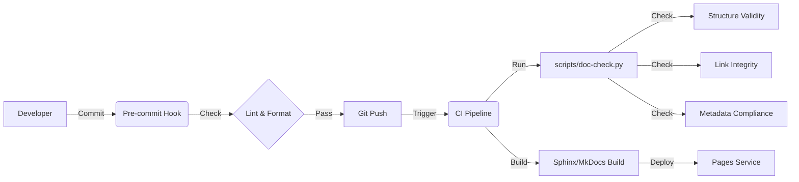

# 文档系统维护开发执行细则 (Document System Maintenance & Development Execution Plan)

**版本**: v1.0
**日期**: 2026-03-09
**状态**: Draft
**责任人**: Trae AI Agent (Acting Docs Owner)
**关联文档**:
- `docs/reviews/DocReview_20260309_v1.0.md` (审查报告)
- `docs/archive/plans/v0.6.0/v0.6.0-doc-governance-execution.md` (上一版本计划)

---

## 1. 目标与范围 (Goals & Scope)

### 1.1 核心目标
本计划旨在基于 v0.6.0 的治理基础，进一步解决文档系统中残留的结构性冲突、治理规范落地不足及自动化缺失问题。通过引入强制性 CI 门禁与明确的 RACI 流程，构建一个**自愈合、可度量、低熵增**的文档生态系统。

### 1.2 验收标准 (KPIs)
1.  **结构合规率 100%**: 所有目录均包含索引文件 (`README.md`)，无孤儿文件，无深度 > 4 的 Active 目录。
2.  **治理闭环率 100%**: 所有 `reviews` 产物归档至 `governance` 体系，无冗余路径。
3.  **自动化覆盖**: 建立 CI 流水线，包含链接检查 (LinkCheck)、结构校验 (StructureCheck) 与元数据检查 (MetaCheck)。
4.  **职责清晰度**: 核心模块 (Train/Infer/Collect/Label) 文档 Owner 100% 明确并公示。

---

## 2. 现状差距矩阵 (Gap Analysis Matrix)

| ID | 问题描述 (Gap) | 根因分析 | 建议方案 (Proposal) | 计划任务 (Task ID) |
| :--- | :--- | :--- | :--- | :--- |
| G-01 | `docs/reviews` 与 `governance/audits` 职能重叠 | 新增目录未遵循既有治理架构 | **合并**: 将 `reviews` 迁移至 `governance/reviews`，统一入口 | T-STRUCT-01 |
| G-02 | 多个核心目录 (`reports`, `plans`) 缺失索引文件 | 缺乏脚手架与强制检查 | **补全**: 批量创建标准 `README.md` 模板 | T-CONTENT-01 |
| G-03 | 归档目录 (`archive`) 深度过深 (5层+) | 版本化归档策略过于机械 | **扁平化**: 优化归档命名规则，减少嵌套 | T-STRUCT-02 |
| G-04 | 缺乏可视化的 RACI 职责矩阵 | 仅在文字中描述，检索困难 | **可视化**: 在 `maintenance.md` 中绘制表格 | T-GOV-01 |
| G-05 | 缺乏自动化 CI 检查 | 依赖人工 Review，易遗漏 | **集成**: 引入 `doc-check` 脚本至 CI | T-AUTO-01 |

---

## 3. 详细工作分解 (WBS)

### 3.1 结构重构 (Structure Refactoring)
*   **T-STRUCT-01** (High, 2h): 迁移 `docs/reviews` 至 `docs/governance/reviews`。
    *   前置: 无
    *   输出: 目录移动，更新引用链接。
*   **T-STRUCT-02** (Medium, 1h): 优化 `docs/archive` 结构。
    *   操作: 将 `docs/archive/plans/v0.6.0/` 扁平化为 `docs/archive/v0.6.0/plans/` (按版本归档而非按类型)。
*   **T-STRUCT-03** (High, 1h): 清理 `docs/reports` 根目录。
    *   操作: 将非 Active 报告移入 `docs/archive/reports`，仅保留模板或当前季度报告。

### 3.2 内容补全 (Content Completion)
*   **T-CONTENT-01** (High, 2h): 为缺失目录创建 `README.md`。
    *   范围: `docs/governance/reviews/`, `docs/reports/`, `docs/plans/`, `docs/archive/reports/`。
    *   内容: 目录用途、文件命名规范、贡献指南。
*   **T-CONTENT-02** (Medium, 1h): 更新 `docs/README.md`。
    *   操作: 同步新的目录结构，增加 `governance/reviews` 入口。

### 3.3 治理体系 (Governance System)
*   **T-GOV-01** (High, 1h): 落地 RACI 矩阵。
    *   操作: 将审查报告中的 RACI 表格写入 `docs/policy/maintenance.md`。
*   **T-GOV-02** (Medium, 1h): 定义审计日志格式。
    *   操作: 在 `docs/governance/reviews/README.md` 中定义 Review 报告的 Front Matter 标准。

### 3.4 自动化与工具 (Automation)
*   **T-AUTO-01** (High, 4h): 开发 `scripts/doc-check.py`。
    *   功能: 检查死链、检查 `README.md` 是否存在、检查 Front Matter。
*   **T-AUTO-02** (Medium, 2h): 集成 GitHub Actions / Pre-commit。
    *   操作: 配置 `.github/workflows/doc-lint.yml`。

---

## 4. 技术方案与架构 (Technical Solution)

### 4.1 工具链集成


### 4.2 文档生成与发布
*   **生成器**: 沿用 Sphinx (如有) 或迁移至 MkDocs (推荐，因 Markdown 友好)。
*   **发布策略**: 
    *   `main` 分支 -> `latest` 文档。
    *   `tags/v*` -> 对应版本文档快照。

---

## 5. 质量门禁与评审流程 (Quality Gates)

### 5.1 自动化阈值
*   **Error**: 任何死链 (404)、缺失 `README.md`、缺失必填元数据 -> **Block Merge**。
*   **Warning**: 目录深度 > 4、单目录文件数 > 15 -> **Review Required**。

### 5.2 评审规范 (Review Checklist)
*   [ ] 变更是否同步更新了 `docs/reference` (如涉及配置)？
*   [ ] 新增文件是否包含 `Status/Audience/Last-Updated`？
*   [ ] 是否在 `docs-structure.md` 中注册了新目录？

---

## 6. 角色权限与治理模型 (Governance Model)

| 角色 (Role) | 职责 (Responsibilities) | 权限 (Permissions) |
| :--- | :--- | :--- |
| **Docs Owner** | 制定规范、审核架构变更、维护工具链 | Merge PRs in `docs/policy`, `docs/governance` |
| **Module Owner** | 维护对应模块的 Guide/Reference | Merge PRs in `docs/guides/<module>`, `docs/reference` |
| **Contributor** | 提交文档修复、撰写新功能文档 | Propose PRs |

---

## 7. 版本与配置管理 (Version Control)

*   **分支策略**: 文档与代码同库同分支 (`monorepo`)。
*   **多版本维护**: 
    *   现行版本：`docs/` 根目录。
    *   历史版本：`docs/archive/vX.Y/`。
*   **废弃策略**: 废弃功能文档移入 `archive`，并在原位置保留 `Redirect` 或 `Deprecation Note`。

---

## 8. 自动化脚本与模板 (Automation Scripts)

### 8.1 脚本清单
*   `scripts/check_docs_structure.py`: 递归检查 `README.md` 存在性与目录深度。
*   `scripts/check_links.py`: 扫描 Markdown 内部链接有效性。
*   `scripts/scaffold_doc.py`: 生成带标准头的 Markdown 模板。

### 8.2 模板示例 (Front Matter)
```yaml
---
title: 文档标题
status: active # active, draft, archived
audience: developers # developers, users, maintainers
owner: @role-or-team
last-updated: 2026-03-09
---
```

---

## 9. 度量、监控与持续改进 (Metrics)

*   **季度复盘**: 每季度末 (3/6/9/12月) 召开文档治理委员会会议。
*   **监控指标**:
    *   文档覆盖率 (功能点 vs 文档条目)。
    *   CI 文档检查通过率。
    *   Issue 中 "Documentation" 标签的数量与解决时长。

---

## 10. 风险清单与应急预案 (Risks)

| 风险点 | 可能性 | 影响 | 预案 (Mitigation) |
| :--- | :--- | :--- | :--- |
| **文档与代码不同步** | High | High | 在 PR Template 中增加“文档确认”勾选项；CI 强制检查 Config Schema 一致性。 |
| **历史链接失效** | Medium | Medium | 归档时使用相对链接锚点；在站点配置中设置 301 重定向。 |
| **治理疲劳** | Medium | Low | 保持工具链简单 (Keep it simple)，避免过度复杂的元数据要求。 |

---

## 11. 交付物清单 (Deliverables)

1.  **重构后的目录结构**: 符合 v1.0 治理规范。
2.  **合规性报告**: `docs/governance/reviews/Governance_Compliance_Report_v1.1.md`。
3.  **自动化脚本**: `scripts/doc-check.py` 等。
4.  **更新的治理文档**: `maintenance.md`, `README.md`。

---

## 12. 维护窗口与发布日历 (Calendar)

*   **日常**: 随代码 PR 实时更新。
*   **冻结期**: Release 前 3 天文档冻结，仅允许修辞/格式修正。
*   **Hotfix**: 发现严重误导性文档错误，可随时提交 Hotfix PR。

---

## 13. 培训与知识转移 (Training)

*   **对象**: 全体核心开发者。
*   **内容**: 
    *   如何使用脚手架创建文档。
    *   如何运行本地文档检查。
    *   文档写作风格指南 (Tone & Style)。
*   **形式**: 内部 Wiki + 1小时分享会。

---

## 14. 后续迭代路线图 (Roadmap)

*   **v0.7.0**: 
    *   引入国际化 (i18n) 基础架构支持 (中/英)。
    *   集成 LLM 辅助文档生成工具。
*   **v0.8.0**:
    *   建立交互式 API 文档 (基于 OpenAPI/Swagger)。
