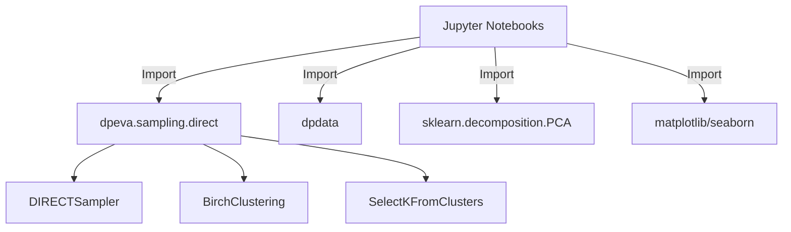

toolName: view_folder
            
status: success
          
/home/pku-jianghong/liuzhaoqing/WORK/FT2DP-DPEVA/dpeva/examples
          

        
            
toolName: run_command
            
status: success
          
command: find examples -maxdepth 3 undefined
          

        
            
toolName: view_files
            
status: success
          
            
filePath: /home/pku-jianghong/liuzhaoqing/WORK/FT2DP-DPEVA/dpeva/examples/sampling/direct.ipynb
          

        
            
toolName: view_files
            
status: success
          
            
filePath: /home/pku-jianghong/liuzhaoqing/WORK/FT2DP-DPEVA/dpeva/examples/sampling/2-direct.ipynb
          
对 `dpeva/examples` 目录及其内部原有文件（主要是 `sampling` 子目录下的 Jupyter Notebooks）的审计与架构分析报告如下：

### 1. 目录结构与文件清单

`examples` 目录目前包含两个主要部分：
1.  **`recipes/`**: 存放刚刚迁移过来的标准工作流调用脚本（本报告不涉及）。
2.  **`sampling/`**: 存放关于 DIRECT 采样算法的高级用法和演示的 Jupyter Notebooks。
3.  **`data/` & `img/`**: 存放示例所需的数据文件（如描述符 `desc.npy`）和图片资源。

本报告重点分析 `sampling/` 目录下的两个核心文件：
*   `examples/sampling/direct.ipynb`
*   `examples/sampling/2-direct.ipynb`

---

### 2. 文件级功能解析

#### 2.1 `examples/sampling/direct.ipynb` (DIRECT 采样演示)

*   **功能定位**: 演示基础的 DIRECT (Dimensionality Reduction and Clustering) 采样流程。展示如何加载描述符数据，使用 BIRCH 聚类和 PCA 降维进行样本筛选，并对比随机采样（Manual）的效果。
*   **核心业务流程**:
    1.  **数据加载**: 读取 `../data/desc.npy` (结构描述符)。
    2.  **DIRECT 采样**: 实例化 `DIRECTSampler`，配置 `BirchClustering` (聚类) 和 `SelectKFromClusters` (选点)。
    3.  **执行采样**: 调用 `fit_transform` 获取筛选结果。
    4.  **对比实验**: 执行随机采样作为基准。
    5.  **可视化**: 绘制 PCA 空间覆盖度对比图（DIRECT vs Manual）。
*   **关键类/函数**:
    *   `dpeva.sampling.direct.DIRECTSampler`: 核心采样器。
    *   `dpeva.sampling.direct.BirchClustering`: 聚类策略。
    *   `dpeva.sampling.direct.SelectKFromClusters`: 簇内选点策略。
    *   `plot_PCAfeature_coverage` (Notebook 内定义): 可视化辅助函数。
    *   `calculate_feature_coverage_score` (Notebook 内定义): 覆盖度计算辅助函数。

#### 2.2 `examples/sampling/2-direct.ipynb` (2-DIRECT 高级采样演示)

*   **功能定位**: 演示进阶的 "2-DIRECT" 采样策略。该策略旨在处理混合了 Unit Cell 和 Supercell 的数据集，优先选择包含独特原子环境且原子数最少的结构（最小化标注成本）。
*   **核心业务流程**:
    1.  **数据加载**: 读取 `descriptors/*/desc.npy` (原子描述符) 和对应的 `dpdata` (用于获取原子数和元素信息)。
    2.  **结构特征聚合**: 将原子描述符平均池化为结构描述符。
    3.  **第一步 DIRECT (Partition)**: 在结构特征空间进行粗粒度聚类 (Partitioning)，将结构分为若干组。
    4.  **第二步 DIRECT (Selection)**: 对每个结构簇，进一步基于**原子特征**进行聚类，并在子簇中选择**原子数最少**的结构。
    5.  **可视化**: 展示结构特征空间和原子特征空间的覆盖情况。
    6.  **数据导出**: 将筛选出的结构保存为 `deepmd/npy` 格式。
*   **关键类/函数**:
    *   除基础 DIRECT 类外，大量使用了 `dpdata` 库进行数据操作。
    *   使用了自定义的 `selection_criteria="smallest"` 和 `n_sites` 参数在 `SelectKFromClusters` 中。

---

### 3. 架构与依赖分析

#### 3.1 模块调用链

#### 3.2 数据流
*   **输入**: 描述符文件 (`.npy`) -> Numpy Array -> `DIRECTSampler`。
*   **处理**: PCA 降维 -> BIRCH 聚类 -> K-Center/Random 选点。
*   **输出**: 选中样本的索引 (`selected_indices`) -> `dpdata` 对象切片 -> 磁盘文件。

---

### 4. 代码质量评估

#### 4.1 可复用组件与冗余
*   **可视化逻辑冗余**: 两个 Notebook 中都定义了类似的 PCA 绘图和覆盖度计算函数（如 `plot_PCAfeature_coverage`）。这些逻辑在 `src/dpeva` 库中可能没有对应的封装，导致用户（或开发者）需要在脚本中重复编写。
*   **路径硬编码**: Notebook 中大量使用了硬编码的相对路径（如 `../data/desc.npy`, `./data-clean-v2-7-20873-npy`），这降低了示例的通用性和可移植性。

#### 4.2 性能与安全
*   **内存消耗**: `2-direct.ipynb` 中加载了全量的原子描述符 (`desc_perstru`) 到内存列表。对于大规模数据集（如数百万帧），这种列表推导式 (`[af for ... if ...]`) 和全量加载可能会导致 OOM (Out of Memory)。建议使用生成器或分批处理。
*   **安全性**: 代码主要进行数值计算和绘图，无明显安全漏洞。

#### 4.3 可维护性
*   **文档缺失**: Notebook 中的 Markdown 说明较为简略，缺乏对 "2-DIRECT" 方法论的详细数学解释，仅提及了 "MatPES manuscript"。
*   **API 耦合**: 代码紧密依赖 `dpeva` 的内部实现。如果 `dpeva.sampling` 接口变更，这些 Notebook 需要同步更新。

---

### 5. 改进与重构建议

#### 5.1 库层面的改进
1.  **提取可视化工具**: 将 Notebook 中的 `plot_PCAfeature_coverage`, `plot_feature_coverage`, `calculate_feature_coverage_score` 等函数封装到 `dpeva.utils.visualization` 或 `dpeva.sampling.vis` 模块中。这将极大简化用户脚本，并统一绘图风格。
2.  **封装 2-DIRECT 策略**: "2-DIRECT" 逻辑（结构聚类 -> 原子聚类 -> 最小原子数筛选）目前是散落在 Notebook 中的一段长代码。建议将其封装为 `dpeva.sampling.strategies.TwoStepDIRECTSampler` 类，使其成为一个标准的、可配置的采样策略。

#### 5.2 示例层面的改进
1.  **参数化**: 修改 Notebook，使其支持读取配置文件或顶部的参数变量，而不是分散在各 Cell 中的硬编码路径。
2.  **轻量化**: 提供一份微型数据集（如 100 帧），确保存储在 Git 中的示例数据足够小，且 Notebook 可以在 CI/CD 环境中快速运行通过测试。
3.  **转化为 Recipe**: 将 `2-direct.ipynb` 的核心逻辑提炼为一个标准的 Python 脚本 (`examples/recipes/sampling/two_step_direct.py`)，以便高级用户直接在生产环境中使用，而不仅是在 Notebook 中实验。

#### 5.3 文档更新
*   在开发文档中增加一节 "Advanced Sampling Strategies"，专门解释 2-DIRECT 的原理，并引用这些 Notebook 作为交互式教程。

### 总结
`examples/sampling` 下的 Notebooks 展示了 DP-EVA 在标准工作流之外的强大灵活性，但也暴露了部分高级功能（如 2-DIRECT 和特定可视化）尚未沉淀到核心库中的问题。通过将这些逻辑“下沉”到库中，可以显著提升框架的成熟度。